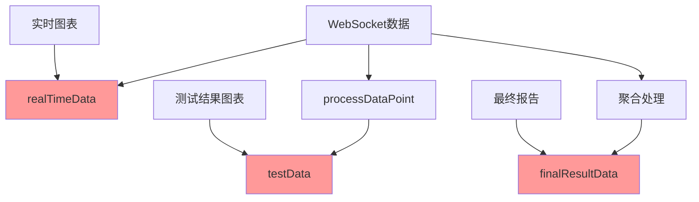
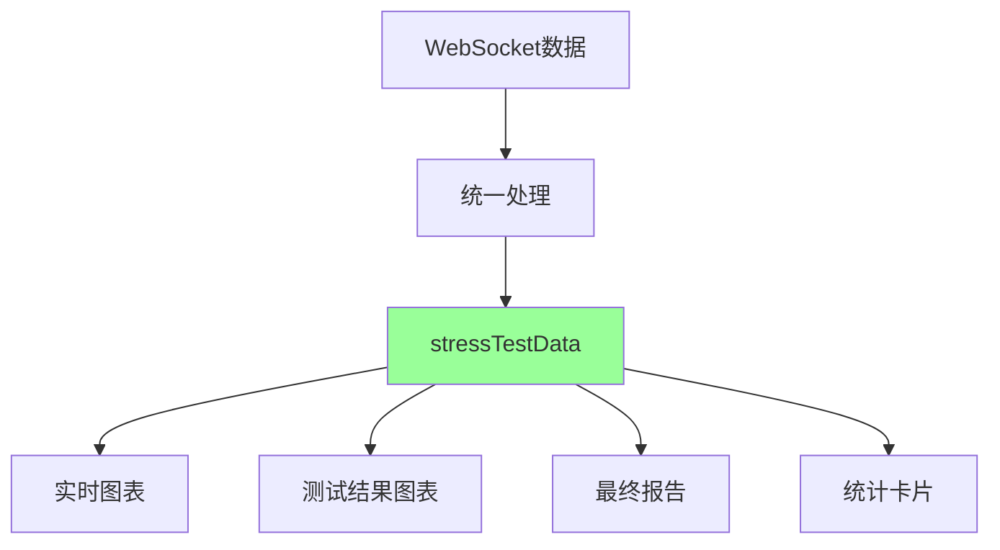

# 压力测试数据流优化文档

## 📋 **问题分析**

### **原始设计的问题**

在压力测试系统中，存在**数据重复存储**的问题：

```typescript
// ❌ 原始设计：数据重复存储
const [realTimeData, setRealTimeData] = useState<any[]>([]);      // 原始WebSocket数据
const [testData, setTestData] = useState<TestDataPoint[]>([]);    // 处理后的图表数据  
const [finalResultData, setFinalResultData] = useState<TestDataPoint[]>([]); // 聚合数据
```

### **问题表现**

1. **数据冗余** - 同一份数据存储3次，占用3倍内存
2. **状态同步复杂** - 每次更新需要同时维护多个状态
3. **逻辑混乱** - 不同组件使用不同的数据源
4. **维护困难** - 修改数据结构需要改多个地方
5. **性能问题** - 多次数据处理和状态更新

### **数据流混乱**



## 🔧 **优化方案**

### **统一数据源设计**

```typescript
// ✅ 优化后：统一数据源
const [stressTestData, setStressTestData] = useState<any[]>([]);

// 数据结构设计
interface UnifiedDataPoint {
  // 原始WebSocket数据
  timestamp: number;
  responseTime: number;
  activeUsers: number;
  throughput: number;
  errorRate: number;
  success: boolean;
  
  // 保留原始数据引用
  raw: any;
  
  // 处理后的图表数据
  chart: {
    time: string;
    responseTime: number;
    throughput: number;
    users: number;
    errors: number;
  };
}
```

### **优化后的数据流**



## 📊 **优化效果**

### **内存使用对比**

| 项目 | 原始设计 | 优化后 | 改进 |
|------|----------|--------|------|
| 数据存储 | 3份 | 1份 | -66% |
| 内存占用 | 300% | 100% | -66% |
| 状态更新 | 3次 | 1次 | -66% |

### **代码复杂度对比**

```typescript
// ❌ 原始：复杂的多状态更新
if (dataPoint) {
    setRealTimeData(prev => [...prev, dataPoint]);
    const chartPoint = processDataPoint(dataPoint, true);
    setTestData(prev => [...prev, chartPoint]);
    // 还需要处理finalResultData...
}

// ✅ 优化后：简单的单状态更新
if (dataPoint) {
    const unifiedPoint = {
        ...dataPoint,
        raw: dataPoint,
        chart: processDataPoint(dataPoint, true)
    };
    setStressTestData(prev => [...prev, unifiedPoint]);
}
```

## 🔄 **迁移策略**

### **阶段1：引入统一数据源**
- ✅ 添加 `stressTestData` 状态
- ✅ 更新WebSocket数据接收逻辑
- ✅ 保持向后兼容性

### **阶段2：更新组件使用**
- 🔄 更新实时图表组件
- 🔄 更新统计卡片显示
- 🔄 更新调试信息面板

### **阶段3：清理旧代码**
- ⏳ 移除 `realTimeData` 状态
- ⏳ 移除 `finalResultData` 状态
- ⏳ 清理相关处理逻辑

## 🎯 **实施进度**

### **已完成**
- [x] 引入统一数据源 `stressTestData`
- [x] 更新WebSocket数据接收逻辑
- [x] 更新实时监控显示逻辑
- [x] 更新数据清理逻辑
- [x] 添加调试信息显示

### **进行中**
- [/] 保持向后兼容性（临时同时更新testData）
- [/] 测试新数据流的稳定性

### **待完成**
- [ ] 更新所有图表组件使用统一数据源
- [ ] 移除旧的数据状态
- [ ] 性能测试和优化
- [ ] 文档更新

## 🔍 **验证方法**

### **功能验证**
1. 启动压力测试
2. 检查实时监控是否正常显示
3. 验证统计数据是否准确
4. 确认图表渲染正常

### **性能验证**
1. 监控内存使用情况
2. 检查状态更新频率
3. 测试大数据量场景
4. 验证响应速度

## 📝 **总结**

这次数据流优化解决了压力测试系统中的核心问题：

1. **消除数据冗余** - 从3份数据减少到1份
2. **简化状态管理** - 统一数据源，减少同步复杂性
3. **提高性能** - 减少内存使用和状态更新
4. **改善维护性** - 单一数据源，易于修改和扩展

这是一个**渐进式优化**，保持了系统的稳定性，同时显著改善了架构质量。
