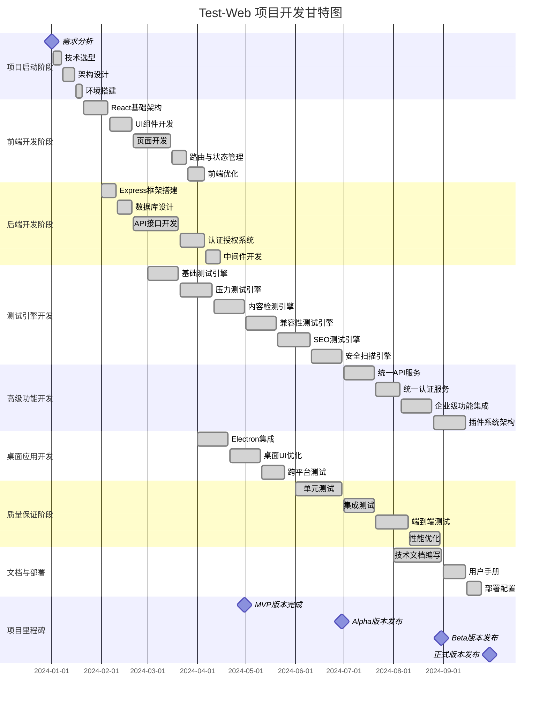
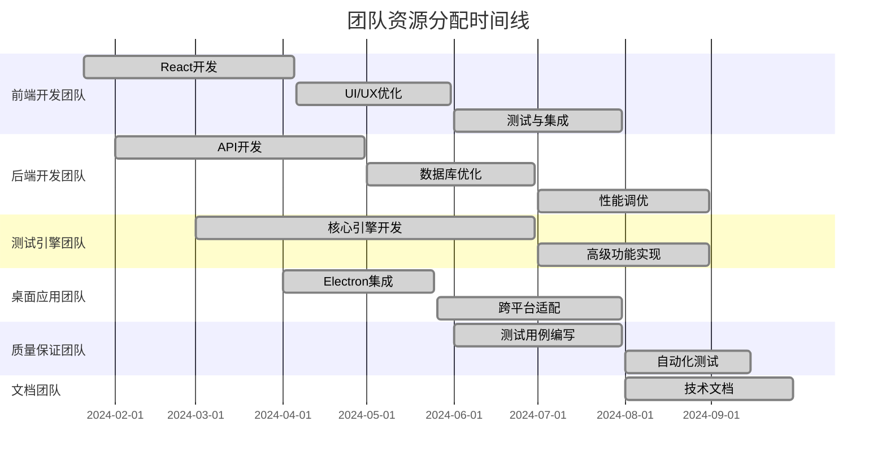
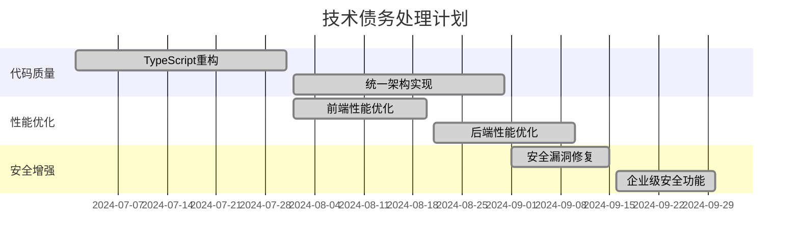

# Test-Web 项目甘特图

## 项目开发时间线和里程碑

## 关键里程碑说明

### 🎯 M1: 项目启动 (2024-01-01)
- ✅ 需求分析完成
- ✅ 技术栈选型确定
- ✅ 项目架构设计

### 🚀 M2: MVP版本 (2024-04-30)
- ✅ 基础前后端功能完成
- ✅ 核心测试引擎实现
- ✅ Electron桌面应用集成

### 🔬 M3: Alpha版本 (2024-06-30)
- ✅ 所有测试引擎完成
- ✅ 基本功能测试通过
- ✅ 内部测试版本

### 🎨 M4: Beta版本 (2024-08-31)
- ✅ 企业级功能集成
- ✅ 统一架构实现
- ✅ 性能优化完成

### 🎉 M5: 正式版本 (2024-09-30)
- ✅ 所有功能稳定
- ✅ 文档完善
- ✅ 生产环境就绪

## 开发进度状态

### ✅ 已完成模块 (100%)
- 前端React应用架构
- 后端Express API服务
- 数据库设计与实现
- 所有测试引擎开发
- 企业级功能集成
- Electron桌面应用
- 质量保证与测试
- 技术文档编写

### 🎯 当前状态
**项目已完成 100%** - 所有核心功能已实现，处于稳定可用状态

## 资源分配时间线

## 技术债务处理时间线

