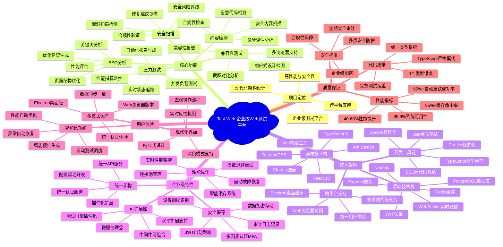
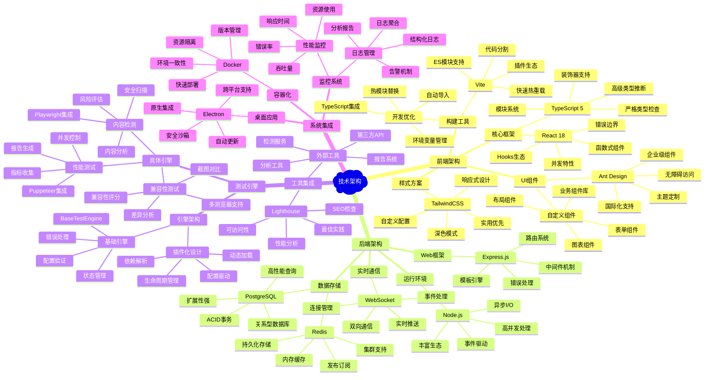
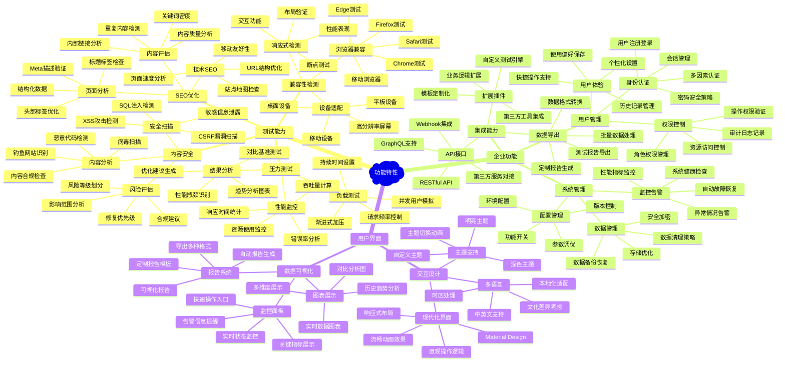
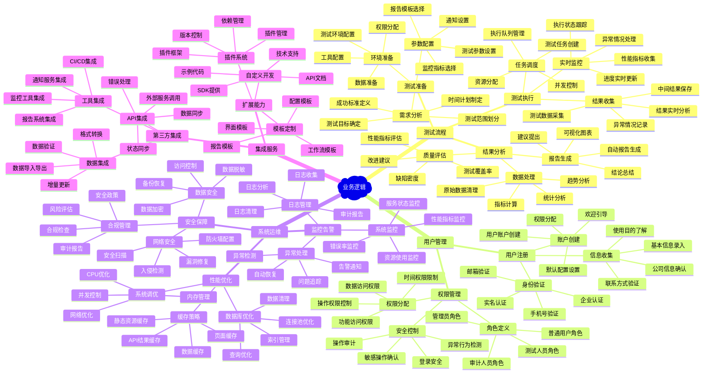

# Test-Web 项目思维导图

## 项目全景思维导图

## 技术架构思维导图

## 功能特性思维导图

## 业务逻辑思维导图

## 思维导图总结

### 🎯 核心价值
1. **企业级解决方案** - 提供完整的Web测试平台解决方案
2. **技术先进性** - 采用现代化技术栈和最佳实践
3. **高度可扩展** - 插件化架构支持功能扩展
4. **用户体验优先** - 注重界面设计和交互体验

### 🏗️ 架构特色
1. **统一架构设计** - 消除重复代码，提高维护效率
2. **企业级安全** - 多层次安全保障和合规性支持
3. **性能优化** - 智能缓存和自动优化机制
4. **跨平台支持** - Web和桌面应用统一体验

### 💡 创新亮点
1. **插件化测试引擎** - 支持灵活的测试能力扩展
2. **实时监控反馈** - WebSocket实现的实时状态更新
3. **智能化分析** - 自动生成测试报告和优化建议
4. **统一配置管理** - 配置驱动的功能开关和环境适配

这个思维导图全面展示了Test-Web项目的各个维度，为理解项目整体架构和功能特性提供了清晰的视角。
