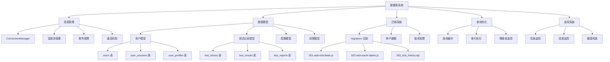
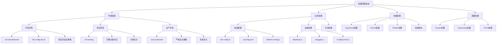
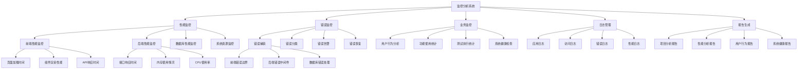
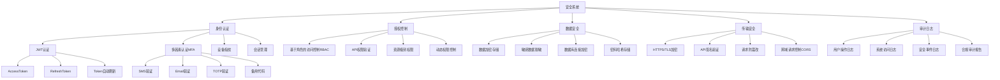

# Test-Web 组织结构图

## 1. 项目总体组织架构

```mermaid
graph TB
    A[Test-Web 项目根目录] --> B[前端模块]
    A --> C[后端模块]
    A --> D[共享模块]
    A --> E[工具模块]
    A --> F[文档模块]
    A --> G[配置模块]
    A --> H[部署模块]
    A --> I[测试模块]
    
    B --> B1[React 应用]
    B --> B2[TypeScript 类型]
    B --> B3[组件库]
    B --> B4[样式系统]
    
    C --> C1[Express 服务]
    C --> C2[数据库层]
    C --> C3[测试引擎]
    C --> C4[中间件]
    
    D --> D1[类型定义]
    D --> D2[工具函数]
    D --> D3[常量配置]
    
    E --> E1[Electron 应用]
    E --> E2[构建脚本]
    E --> E3[开发工具]
    
    F --> F1[技术文档]
    F --> F2[API文档]
    F --> F3[用户指南]
    
    G --> G1[环境配置]
    G --> G2[构建配置]
    G --> G3[部署配置]
    
    H --> H1[Docker 配置]
    H --> H2[K8s 配置]
    H --> H3[CI/CD 配置]
    
    I --> I1[单元测试]
    I --> I2[集成测试]
    I --> I3[E2E 测试]
```

## 2. 前端模块组织结构图

```mermaid
graph TB
    A[frontend/] --> B[src/]
    A --> C[public/]
    A --> D[配置文件]
    
    B --> B1[pages/]
    B --> B2[components/]
    B --> B3[services/]
    B --> B4[hooks/]
    B --> B5[contexts/]
    B --> B6[utils/]
    B --> B7[types/]
    B --> B8[styles/]
    B --> B9[assets/]
    
    B1 --> B11[core/ - 核心功能页面]
    B1 --> B12[user/ - 用户页面]
    B1 --> B13[admin/ - 管理页面]
    B1 --> B14[auth/ - 认证页面]
    
    B11 --> B111[Dashboard.tsx]
    B11 --> B112[StressTest.tsx]
    B11 --> B113[ContentDetection.tsx]
    B11 --> B114[CompatibilityTest.tsx]
    B11 --> B115[SEOAnalysis.tsx]
    
    B2 --> B21[ui/ - 基础UI组件]
    B2 --> B22[business/ - 业务组件]
    B2 --> B23[charts/ - 图表组件]
    B2 --> B24[forms/ - 表单组件]
    B2 --> B25[layout/ - 布局组件]
    B2 --> B26[common/ - 通用组件]
    
    B21 --> B211[Button.tsx]
    B21 --> B212[Modal.tsx]
    B21 --> B213[Table.tsx]
    B21 --> B214[Loading.tsx]
    B21 --> B215[Alert.tsx]
    
    B22 --> B221[TestRunner.tsx]
    B22 --> B222[ResultViewer.tsx]
    B22 --> B223[ProgressBar.tsx]
    B22 --> B224[ConfigPanel.tsx]
    
    B3 --> B31[api.ts - 统一API服务]
    B3 --> B32[auth.ts - 认证服务]
    B3 --> B33[storage.ts - 存储服务]
    B3 --> B34[websocket.ts - WebSocket服务]
    
    B4 --> B41[useAuth.ts]
    B4 --> B42[useApi.ts]
    B4 --> B43[useWebSocket.ts]
    B4 --> B44[useLocalStorage.ts]
    
    B5 --> B51[AuthContext.tsx]
    B5 --> B52[ThemeContext.tsx]
    B5 --> B53[ConfigContext.tsx]
    
    B6 --> B61[date.ts]
    B6 --> B62[validation.ts]
    B6 --> B63[format.ts]
    B6 --> B64[request.ts]
```

## 3. 后端模块组织结构图

```mermaid
graph TB
    A[backend/] --> B[src/]
    A --> C[config/]
    A --> D[routes/]
    A --> E[middleware/]
    A --> F[engines/]
    A --> G[services/]
    A --> H[database/]
    A --> I[utils/]
    A --> J[scripts/]
    
    B --> B1[app.js - 应用入口]
    B --> B2[index.js]
    B --> B3[ConfigManager.js]
    B --> B4[RouteManager.js]
    B --> B5[ErrorMonitoringManager.js]
    
    C --> C1[database.js - 数据库配置]
    C --> C2[swagger.js - API文档配置]
    C --> C3[realtime.js - 实时通信配置]
    C --> C4[ConfigCenter.js - 配置中心]
    
    D --> D1[auth.js - 认证路由]
    D --> D2[core.js - 核心路由]
    D --> D3[test.js - 测试路由]
    D --> D4[seo.js - SEO路由]
    D --> D5[security.js - 安全路由]
    D --> D6[database.js - 数据库路由]
    D --> D7[admin.js - 管理路由]
    
    E --> E1[auth.js - 认证中间件]
    E --> E2[validation.js - 验证中间件]
    E --> E3[errorHandler.js - 错误处理]
    E --> E4[logger.js - 日志中间件]
    E --> E5[cache.js - 缓存中间件]
    E --> E6[rateLimiter.js - 限流中间件]
    
    F --> F1[shared/ - 共享服务]
    F --> F2[content/ - 内容引擎]
    F --> F3[performance/ - 性能引擎]
    F --> F4[seo/ - SEO引擎]
    F --> F5[compatibility/ - 兼容性引擎]
    F --> F6[security/ - 安全引擎]
    F --> F7[database/ - 数据库引擎]
    
    F1 --> F11[services/]
    F1 --> F12[errors/]
    F1 --> F13[monitoring/]
    
    F11 --> F111[BaseService.js]
    F11 --> F112[HTMLParsingService.js]
    F11 --> F113[ContentAnalysisService.js]
    F11 --> F114[PerformanceMetricsService.js]
    F11 --> F115[ReportGenerationService.js]
```

## 4. 测试引擎架构组织图

```mermaid
graph TB
    A[测试引擎系统] --> B[引擎注册中心]
    A --> C[基础引擎类]
    A --> D[具体引擎实现]
    A --> E[引擎支持服务]
    A --> F[外部工具集成]
    
    B --> B1[TestEngineRegistry.ts]
    B --> B2[引擎发现机制]
    B --> B3[引擎调度系统]
    B --> B4[生命周期管理]
    
    C --> C1[BaseTestEngine]
    C --> C2[ITestPlugin 接口]
    C --> C3[PluginManager]
    C --> C4[ConfigManager]
    
    D --> D1[ContentTestEngine]
    D --> D2[PerformanceTestEngine]
    D --> D3[SEOTestEngine]
    D --> D4[CompatibilityTestEngine]
    D --> D5[SecurityTestEngine]
    D --> D6[DatabaseTestEngine]
    
    E --> E1[错误处理服务]
    E --> E2[监控服务]
    E --> E3[缓存服务]
    E --> E4[配置服务]
    E --> E5[日志服务]
    
    F --> F1[Puppeteer 集成]
    F --> F2[Playwright 集成]
    F --> F3[Lighthouse 集成]
    F --> F4[Cheerio HTML解析]
    F --> F5[Sharp 图像处理]
    
    D1 --> D11[内容安全分析]
    D1 --> D12[恶意内容检测]
    D1 --> D13[风险评估]
    
    D2 --> D21[压力测试]
    D2 --> D22[性能监控]
    D2 --> D23[负载分析]
    
    D3 --> D31[页面SEO检测]
    D3 --> D32[关键词分析]
    D3 --> D33[优化建议]
    
    D4 --> D41[多浏览器测试]
    D4 --> D42[响应式检测]
    D4 --> D43[兼容性报告]
    
    D5 --> D51[漏洞扫描]
    D5 --> D52[安全检测]
    D5 --> D53[风险评级]
```

## 5. 数据库架构组织图

## 6. 配置管理架构图

## 7. 脚本管理架构图

```mermaid
graph TB
    A[scripts/ 脚本系统] --> B[core/ 核心脚本]
    A --> C[development/ 开发脚本]
    A --> D[deployment/ 部署脚本]
    A --> E[maintenance/ 维护脚本]
    A --> F[testing/ 测试脚本]
    A --> G[utils/ 工具脚本]
    
    B --> B1[script-manager.cjs]
    B --> B2[project-validator.cjs]
    B --> B3[dependency-checker.cjs]
    B --> B4[config-loader.cjs]
    
    C --> C1[dev-server.cjs]
    C --> C2[hot-reload.cjs]
    C --> C3[type-checker.cjs]
    C --> C4[linter.cjs]
    
    D --> D1[build-optimizer.cjs]
    D --> D2[docker-builder.cjs]
    D --> D3[deployment-manager.cjs]
    D --> D4[environment-setup.cjs]
    
    E --> E1[cleanup-manager.cjs]
    E --> E2[log-analyzer.cjs]
    E --> E3[performance-optimizer.cjs]
    E --> E4[database-maintenance.cjs]
    
    F --> F1[test-runner.cjs]
    F --> F2[coverage-reporter.cjs]
    F --> F3[e2e-manager.cjs]
    F --> F4[test-data-generator.cjs]
    
    G --> G1[file-processor.cjs]
    G --> G2[string-utils.cjs]
    G --> G3[path-resolver.cjs]
    G --> G4[logger.cjs]
```

## 8. 监控与分析架构图

## 9. 安全架构组织图

## 组织结构特点说明

### 🏗️ 架构特点

1. **模块化设计**
   - 清晰的模块边界
   - 职责分离明确
   - 松耦合高内聚

2. **分层架构**
   - 表现层(React前端)
   - 业务层(Express后端)
   - 数据层(PostgreSQL)
   - 工具层(Electron/脚本)

3. **插件化扩展**
   - 测试引擎插件化
   - 中间件可组合
   - 配置驱动功能

4. **微服务理念**
   - 独立的功能模块
   - 统一的接口规范
   - 可扩展的架构设计

### 🎯 管理优势

1. **开发效率**
   - 模块独立开发
   - 团队协作友好
   - 代码复用性高

2. **维护性强**
   - 结构清晰易维护
   - 问题定位快速
   - 升级影响范围可控

3. **扩展性好**
   - 新功能易于集成
   - 支持水平扩展
   - 技术栈可演进
