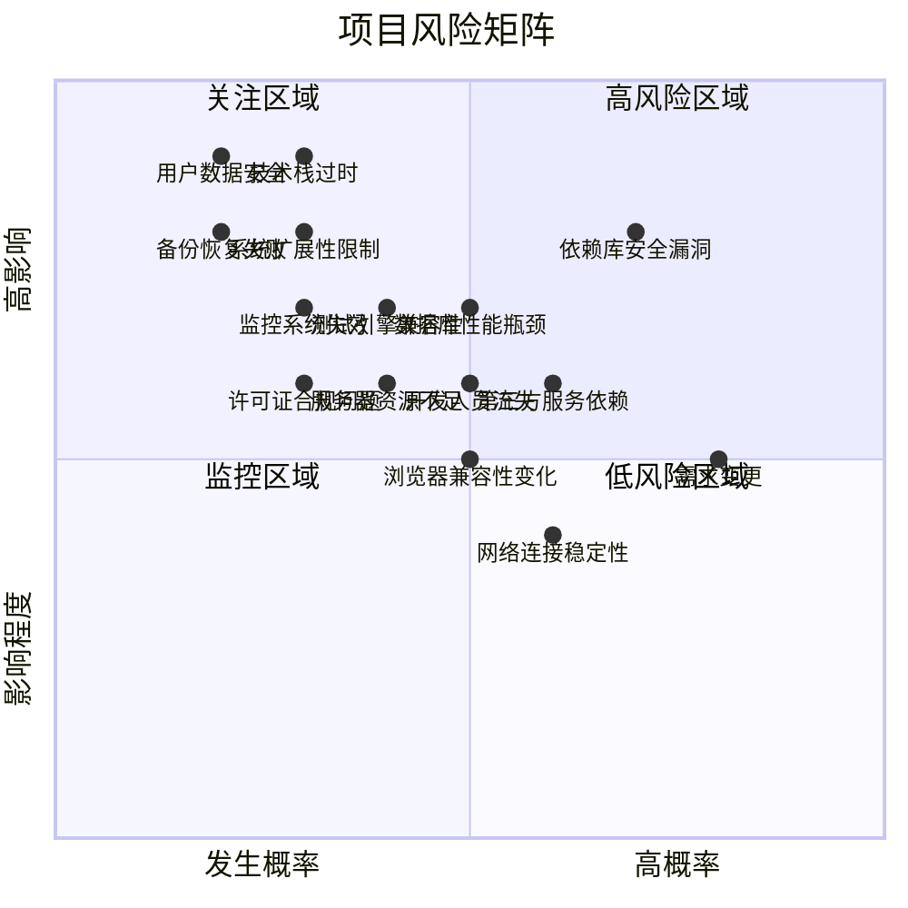
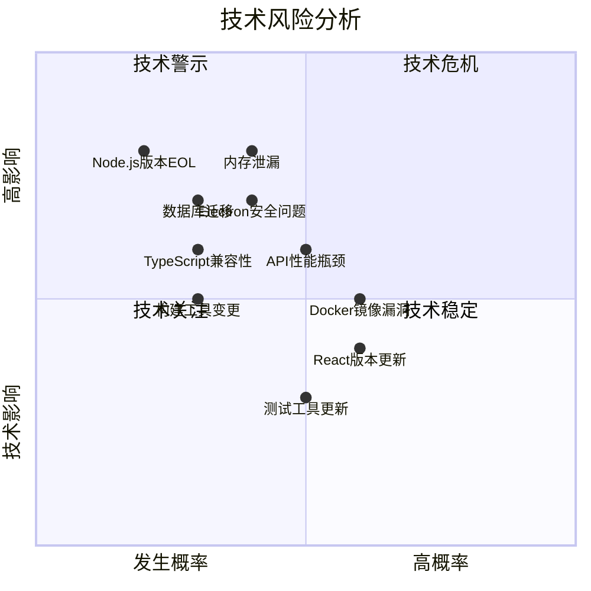
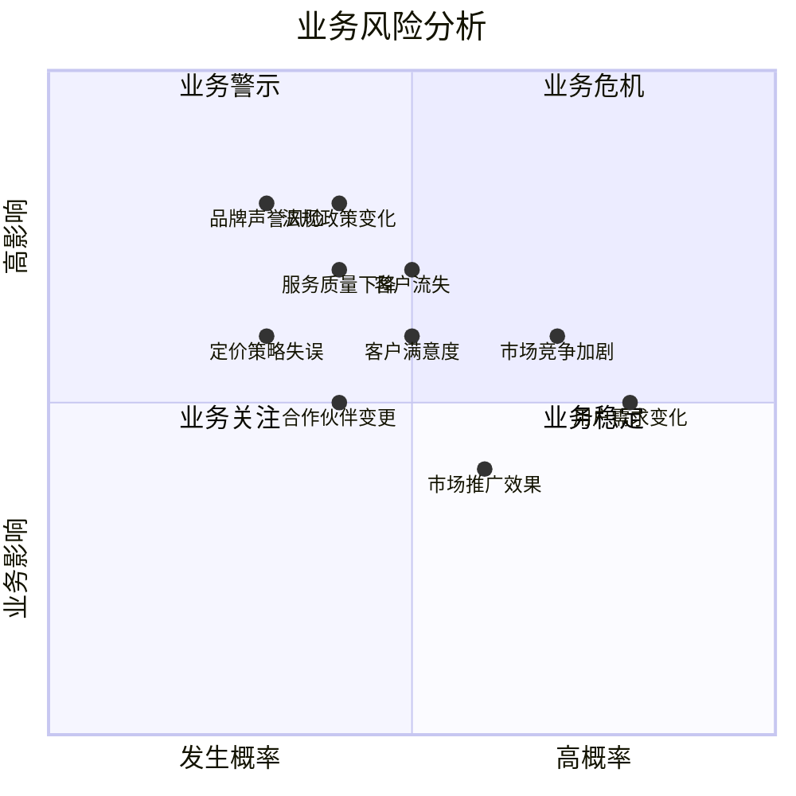
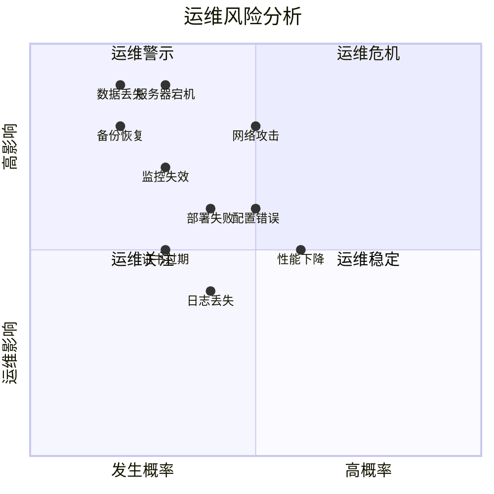
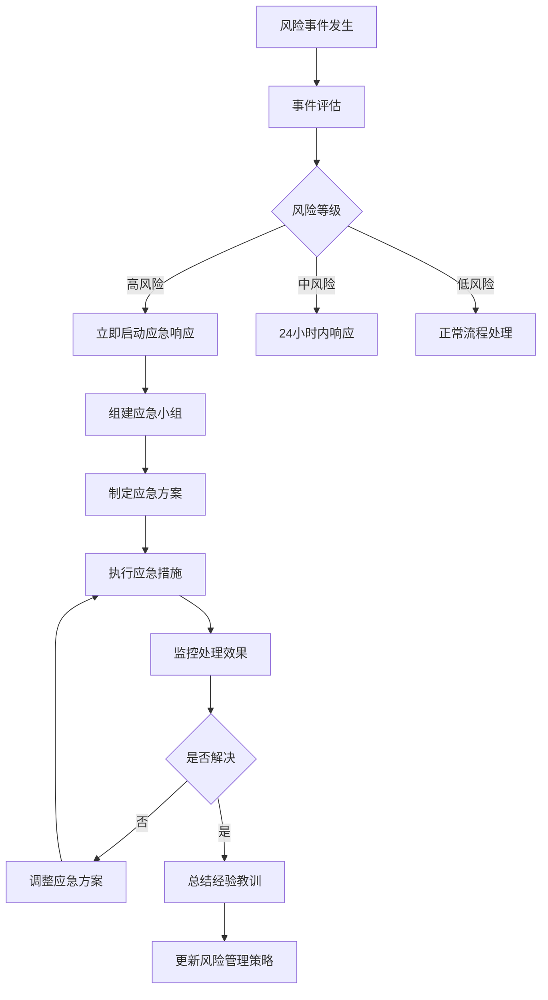

# Test-Web 项目风险矩阵图

## 风险矩阵总览

## 详细风险分析

### 🔴 高风险区域 (高概率 + 高影响)

#### 风险1: 依赖库安全漏洞
- **发生概率**: 高 (70%)
- **影响程度**: 高 (80%)
- **风险描述**: 第三方依赖库存在安全漏洞，可能导致系统被攻击
- **潜在影响**: 
  - 用户数据泄露
  - 系统服务中断
  - 法律合规问题
  - 品牌声誉损害
- **缓解措施**:
  - 定期进行安全审计 (`npm audit`)
  - 及时更新依赖版本
  - 使用安全扫描工具
  - 建立安全响应机制

#### 风险2: 需求频繁变更
- **发生概率**: 高 (80%)
- **影响程度**: 中 (50%)
- **风险描述**: 客户需求不断变化，影响开发进度和质量
- **潜在影响**:
  - 开发周期延长
  - 代码质量下降
  - 团队士气影响
  - 预算超支
- **缓解措施**:
  - 建立变更控制流程
  - 采用敏捷开发方法
  - 加强需求沟通
  - 预留变更缓冲时间

### 🟡 关注区域 (低概率 + 高影响)

#### 风险3: 技术栈过时
- **发生概率**: 低 (30%)
- **影响程度**: 高 (90%)
- **风险描述**: 核心技术栈变得过时，失去社区支持
- **潜在影响**:
  - 维护成本大幅增加
  - 安全漏洞难以修复
  - 人才招聘困难
  - 系统重构需求
- **缓解措施**:
  - 选择成熟稳定的技术栈
  - 定期评估技术趋势
  - 保持技术架构的灵活性
  - 建立技术升级计划

#### 风险4: 用户数据安全事件
- **发生概率**: 低 (20%)
- **影响程度**: 高 (90%)
- **风险描述**: 用户敏感数据被泄露或篡改
- **潜在影响**:
  - 法律诉讼风险
  - 监管处罚
  - 用户信任丧失
  - 业务停摆
- **缓解措施**:
  - 实施数据加密
  - 建立访问控制
  - 定期安全审计
  - 制定应急响应计划

#### 风险5: 系统扩展性限制
- **发生概率**: 低 (30%)
- **影响程度**: 高 (80%)
- **风险描述**: 系统架构无法支撑业务快速增长
- **潜在影响**:
  - 性能严重下降
  - 用户体验差
  - 系统重构成本高
  - 错失市场机会
- **缓解措施**:
  - 采用微服务架构
  - 实现水平扩展
  - 性能监控和优化
  - 容量规划管理

### 🟠 监控区域 (高概率 + 低影响)

#### 风险6: 网络连接不稳定
- **发生概率**: 高 (60%)
- **影响程度**: 中 (40%)
- **风险描述**: 网络连接问题影响系统正常使用
- **缓解措施**:
  - 实现自动重连机制
  - 提供离线功能
  - 多网络提供商备用
  - 网络状态监控

#### 风险7: 第三方服务依赖
- **发生概率**: 高 (60%)
- **影响程度**: 中 (60%)
- **风险描述**: 依赖的第三方服务出现故障或变更
- **缓解措施**:
  - 服务降级机制
  - 多服务商备选
  - 本地缓存备份
  - SLA监控

### 🟢 低风险区域 (低概率 + 低影响)

#### 风险8: 许可证合规问题
- **发生概率**: 低 (30%)
- **影响程度**: 中 (60%)
- **风险描述**: 使用的开源软件许可证存在合规风险
- **缓解措施**:
  - 许可证审查流程
  - 使用许可证管理工具
  - 法律顾问咨询
  - 替代方案准备

## 风险分类详细分析

### 📱 技术风险矩阵

### 💼 业务风险矩阵

### 🛠️ 运维风险矩阵

## 风险应对策略

### 🎯 风险预防措施

#### 技术层面
1. **代码质量保障**
   - 代码审查制度
   - 自动化测试覆盖
   - 静态代码分析
   - 持续集成验证

2. **安全防护机制**
   - 多层安全防护
   - 定期安全扫描
   - 漏洞管理流程
   - 安全培训体系

3. **性能优化策略**
   - 性能监控系统
   - 容量规划管理
   - 缓存优化机制
   - 数据库性能调优

#### 业务层面
1. **需求管理**
   - 需求变更控制
   - 敏捷开发实践
   - 持续沟通机制
   - 原型验证方法

2. **市场应对**
   - 竞争对手分析
   - 用户反馈收集
   - 快速迭代能力
   - 差异化定位

#### 运维层面
1. **高可用设计**
   - 冗余备份机制
   - 故障自动恢复
   - 负载均衡配置
   - 灾难恢复计划

2. **监控告警**
   - 全方位监控体系
   - 智能告警机制
   - 问题快速定位
   - 性能趋势分析

### 📊 风险监控指标

| 风险类别 | 监控指标 | 阈值 | 监控频率 |
|---------|---------|------|----------|
| 性能风险 | API响应时间 | >2秒 | 实时 |
| 安全风险 | 漏洞扫描结果 | 高危>0 | 每周 |
| 可用性风险 | 系统正常运行时间 | <99% | 每日 |
| 数据风险 | 备份成功率 | <100% | 每日 |
| 容量风险 | 资源使用率 | >80% | 实时 |
| 业务风险 | 用户满意度 | <4.0 | 每月 |

### 🚨 应急响应流程

## 风险管理建议

### 🎯 短期行动计划 (1-3个月)
1. **立即处理高风险项**
   - 依赖库安全漏洞修复
   - 数据安全机制完善
   - 系统性能优化

2. **建立监控体系**
   - 部署性能监控工具
   - 建立安全扫描机制
   - 完善日志记录系统

### 📈 中期改进计划 (3-12个月)
1. **架构优化升级**
   - 系统扩展性改进
   - 微服务架构演进
   - 数据库性能优化

2. **团队能力建设**
   - 安全意识培训
   - 技能提升计划
   - 应急处理演练

### 🚀 长期发展规划 (1-3年)
1. **技术栈演进**
   - 定期技术评估
   - 平滑技术升级
   - 创新技术引入

2. **业务持续性**
   - 多地域部署
   - 灾难恢复体系
   - 业务连续性保障

通过系统性的风险管理，Test-Web项目能够在保障稳定运行的同时，支持业务的持续发展和创新。
