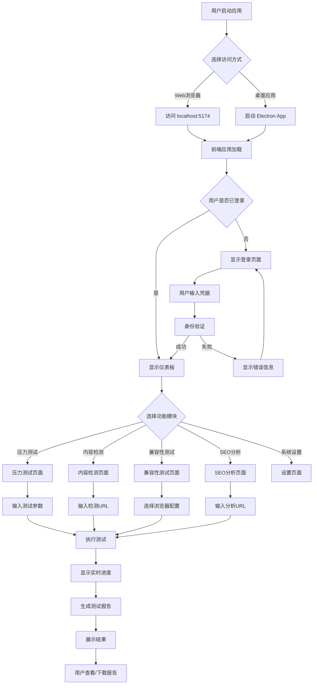
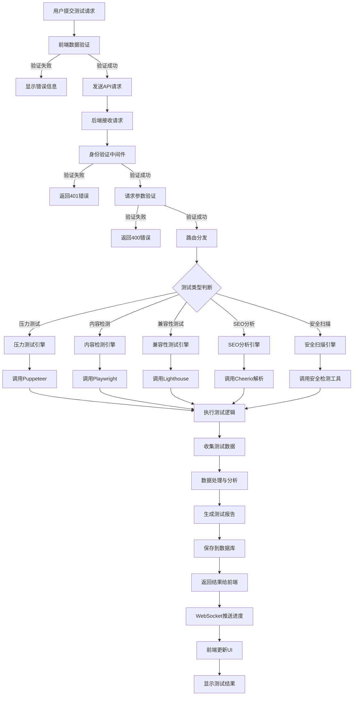
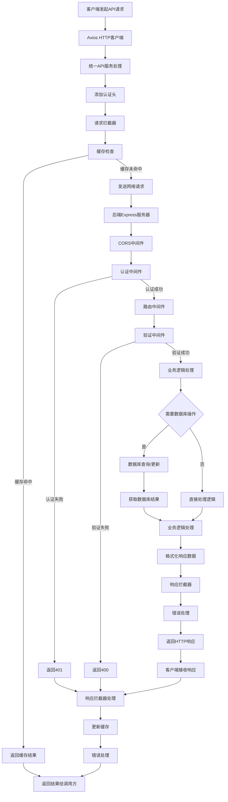
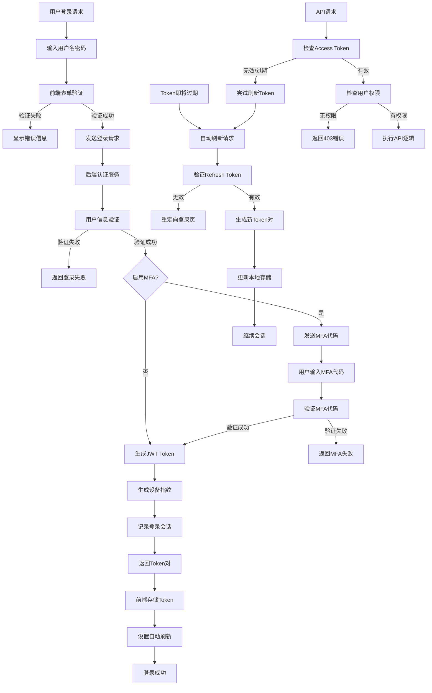
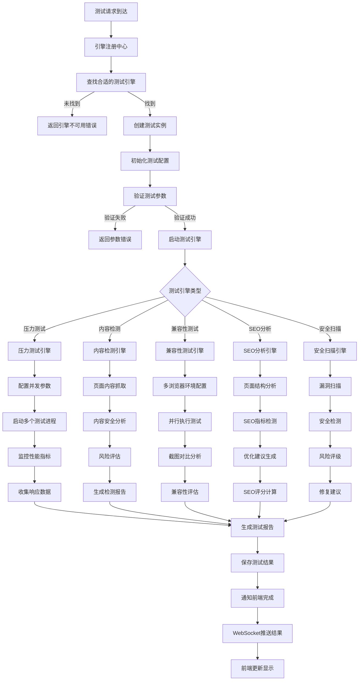
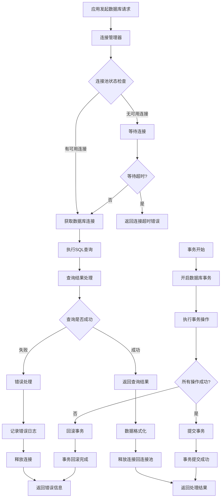
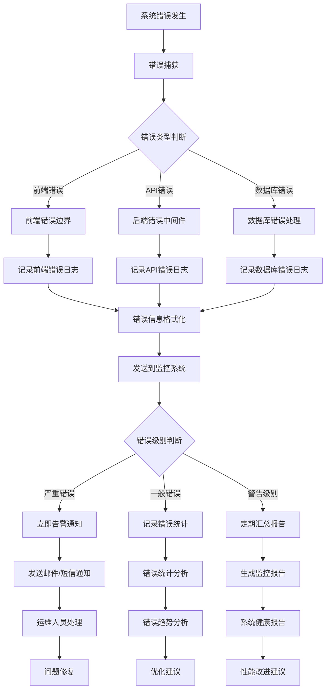
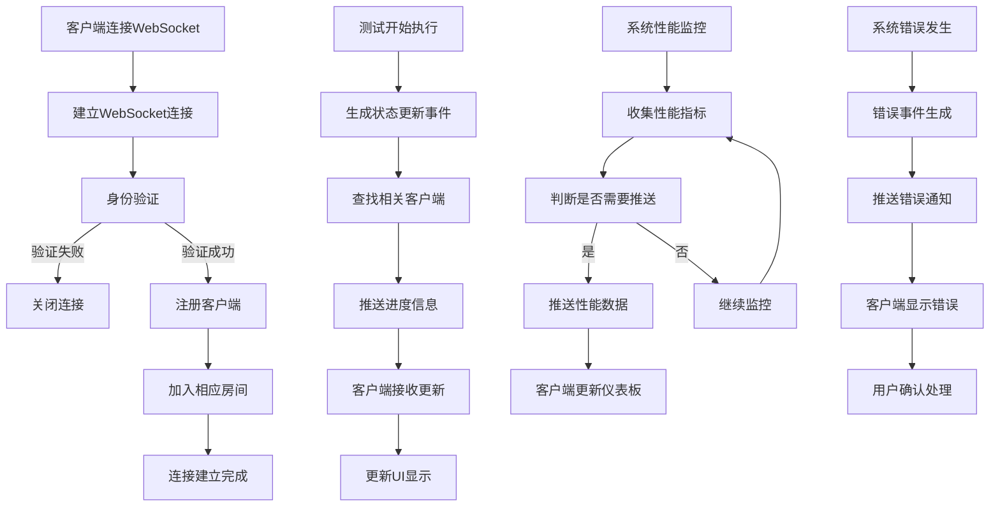

# Test-Web 系统流程图

## 1. 用户使用流程图

## 2. 测试执行数据流程图

## 3. API调用流程图

## 4. 认证与授权流程图

## 5. 测试引擎执行流程图

## 6. 数据库操作流程图

## 7. 错误处理与监控流程图

## 8. WebSocket实时通信流程图

## 流程图说明

### 🎯 关键流程特点

1. **用户体验优化**
   - 支持Web和桌面双模式访问
   - 统一的身份认证体验
   - 实时进度反馈

2. **安全性保障**
   - 多层次身份验证
   - JWT Token自动刷新
   - MFA多因素认证

3. **高可用性设计**
   - 连接池管理
   - 自动重试机制
   - 错误恢复策略

4. **实时性支持**
   - WebSocket实时通信
   - 进度状态推送
   - 监控数据更新

5. **模块化架构**
   - 测试引擎插件化
   - 中间件链式处理
   - 统一错误处理
