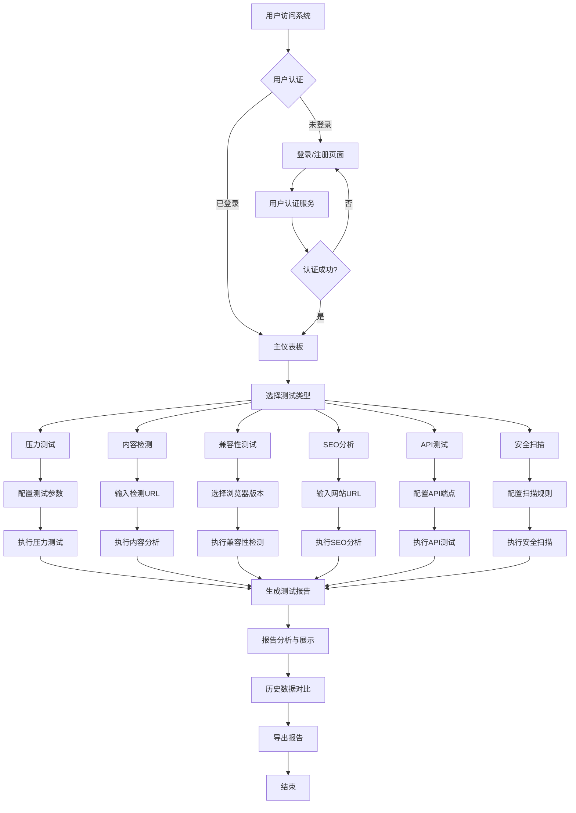
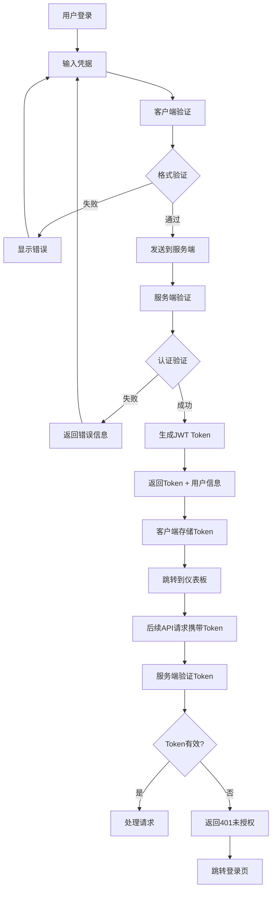
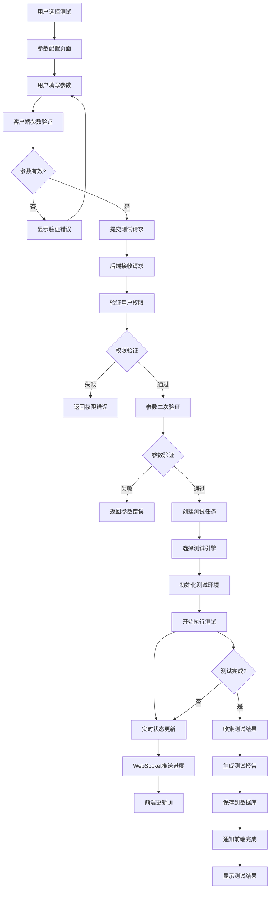
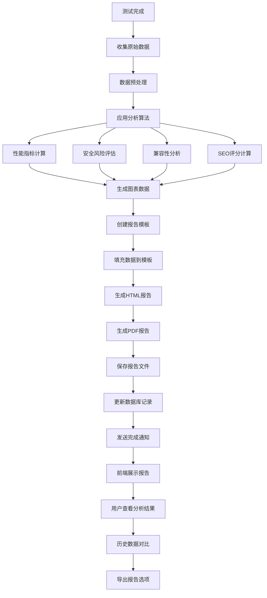
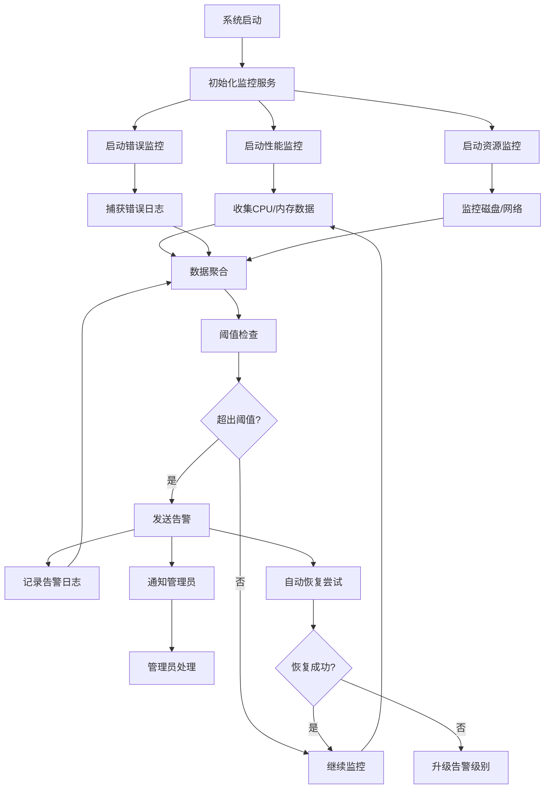
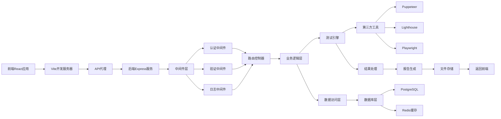
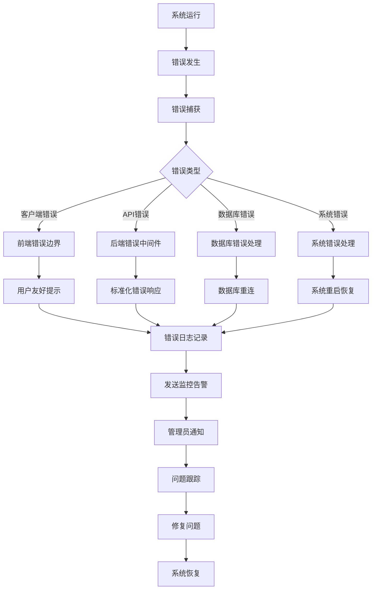
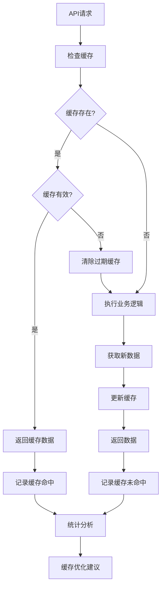

# Test-Web 业务流程图

## 整体业务流程

```mermaid
flowchart TD
    A[用户访问系统] --> B{用户认证}
    B -->|未登录| C[登录/注册页面]
    B -->|已登录| D[主仪表板]
    
    C --> E[用户认证服务]
    E --> F{认证成功?}
    F -->|是| D
    F -->|否| C
    
    D --> G[选择测试类型]
    
    G --> H[压力测试]
    G --> I[内容检测]  
    G --> J[兼容性测试]
    G --> K[SEO分析]
    G --> L[API测试]
    G --> M[安全扫描]
    
    H --> H1[配置测试参数]
    I --> I1[输入检测URL]
    J --> J1[选择浏览器版本]
    K --> K1[输入网站URL]
    L --> L1[配置API端点]
    M --> M1[配置扫描规则]
    
    H1 --> H2[执行压力测试]
    I1 --> I2[执行内容分析]
    J1 --> J2[执行兼容性检测]
    K1 --> K2[执行SEO分析]
    L1 --> L2[执行API测试]
    M1 --> M2[执行安全扫描]
    
    H2 --> N[生成测试报告]
    I2 --> N
    J2 --> N
    K2 --> N
    L2 --> N
    M2 --> N
    
    N --> O[报告分析与展示]
    O --> P[历史数据对比]
    P --> Q[导出报告]
    Q --> R[结束]
```

## 用户认证流程

```mermaid
flowchart TD
    A[用户登录] --> B[输入凭据]
    B --> C[客户端验证]
    C --> D{格式验证}
    D -->|失败| E[显示错误]
    D -->|通过| F[发送到服务端]
    
    F --> G[服务端验证]
    G --> H{认证验证}
    H -->|失败| I[返回错误信息]
    H -->|成功| J[生成JWT Token]
    
    J --> K[返回Token + 用户信息]
    K --> L[客户端存储Token]
    L --> M[跳转到仪表板]
    
    E --> B
    I --> B
    
    M --> N[后续API请求携带Token]
    N --> O[服务端验证Token]
    O --> P{Token有效?}
    P -->|是| Q[处理请求]
    P -->|否| R[返回401未授权]
    R --> S[跳转登录页]
```

## 测试执行流程

```mermaid
flowchart TD
    A[用户选择测试] --> B[参数配置页面]
    B --> C[用户填写参数]
    C --> D[客户端参数验证]
    D --> E{参数有效?}
    E -->|否| F[显示验证错误]
    E -->|是| G[提交测试请求]
    
    F --> C
    G --> H[后端接收请求]
    H --> I[验证用户权限]
    I --> J{权限验证}
    J -->|失败| K[返回权限错误]
    J -->|通过| L[参数二次验证]
    
    L --> M{参数验证}
    M -->|失败| N[返回参数错误]
    M -->|通过| O[创建测试任务]
    
    O --> P[选择测试引擎]
    P --> Q[初始化测试环境]
    Q --> R[开始执行测试]
    
    R --> S[实时状态更新]
    S --> T[WebSocket推送进度]
    T --> U[前端更新UI]
    
    R --> V{测试完成?}
    V -->|否| S
    V -->|是| W[收集测试结果]
    
    W --> X[生成测试报告]
    X --> Y[保存到数据库]
    Y --> Z[通知前端完成]
    Z --> AA[显示测试结果]
```

## 报告生成与分析流程

```mermaid
flowchart TD
    A[测试完成] --> B[收集原始数据]
    B --> C[数据预处理]
    C --> D[应用分析算法]
    
    D --> E[性能指标计算]
    D --> F[安全风险评估]
    D --> G[兼容性分析]
    D --> H[SEO评分计算]
    
    E --> I[生成图表数据]
    F --> I
    G --> I
    H --> I
    
    I --> J[创建报告模板]
    J --> K[填充数据到模板]
    K --> L[生成HTML报告]
    L --> M[生成PDF报告]
    
    M --> N[保存报告文件]
    N --> O[更新数据库记录]
    O --> P[发送完成通知]
    
    P --> Q[前端展示报告]
    Q --> R[用户查看分析结果]
    R --> S[历史数据对比]
    S --> T[导出报告选项]
```

## 系统监控流程

```mermaid
flowchart TD
    A[系统启动] --> B[初始化监控服务]
    B --> C[启动性能监控]
    B --> D[启动错误监控]
    B --> E[启动资源监控]
    
    C --> F[收集CPU/内存数据]
    D --> G[捕获错误日志]
    E --> H[监控磁盘/网络]
    
    F --> I[数据聚合]
    G --> I
    H --> I
    
    I --> J[阈值检查]
    J --> K{超出阈值?}
    K -->|是| L[发送告警]
    K -->|否| M[继续监控]
    
    L --> N[记录告警日志]
    L --> O[通知管理员]
    L --> P[自动恢复尝试]
    
    M --> F
    N --> I
    O --> Q[管理员处理]
    P --> R{恢复成功?}
    R -->|是| M
    R -->|否| S[升级告警级别]
```

## 数据流转流程

```mermaid
flowchart LR
    A[前端React应用] --> B[Vite开发服务器]
    B --> C[API代理]
    C --> D[后端Express服务]
    
    D --> E[中间件层]
    E --> F[认证中间件]
    E --> G[验证中间件]
    E --> H[日志中间件]
    
    F --> I[路由控制器]
    G --> I
    H --> I
    
    I --> J[业务逻辑层]
    J --> K[测试引擎]
    J --> L[数据访问层]
    
    K --> M[第三方工具]
    M --> N[Puppeteer]
    M --> O[Lighthouse]
    M --> P[Playwright]
    
    L --> Q[数据库层]
    Q --> R[PostgreSQL]
    Q --> S[Redis缓存]
    
    K --> T[结果处理]
    T --> U[报告生成]
    U --> V[文件存储]
    V --> W[返回前端]
```

## 错误处理流程

```mermaid
flowchart TD
    A[系统运行] --> B[错误发生]
    B --> C[错误捕获]
    C --> D{错误类型}
    
    D -->|客户端错误| E[前端错误边界]
    D -->|API错误| F[后端错误中间件]
    D -->|数据库错误| G[数据库错误处理]
    D -->|系统错误| H[系统错误处理]
    
    E --> I[用户友好提示]
    F --> J[标准化错误响应]
    G --> K[数据库重连]
    H --> L[系统重启恢复]
    
    I --> M[错误日志记录]
    J --> M
    K --> M
    L --> M
    
    M --> N[发送监控告警]
    N --> O[管理员通知]
    O --> P[问题跟踪]
    P --> Q[修复问题]
    Q --> R[系统恢复]
```

## 缓存策略流程

```mermaid
flowchart TD
    A[API请求] --> B[检查缓存]
    B --> C{缓存存在?}
    C -->|是| D{缓存有效?}
    C -->|否| E[执行业务逻辑]
    
    D -->|是| F[返回缓存数据]
    D -->|否| G[清除过期缓存]
    G --> E
    
    E --> H[获取新数据]
    H --> I[更新缓存]
    I --> J[返回数据]
    
    F --> K[记录缓存命中]
    J --> L[记录缓存未命中]
    
    K --> M[统计分析]
    L --> M
    M --> N[缓存优化建议]
```
