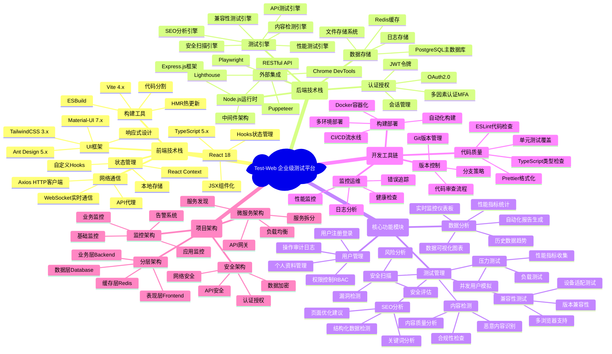
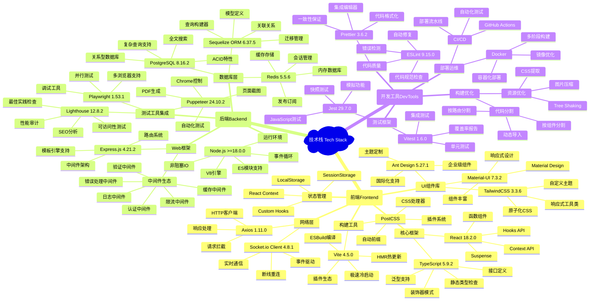
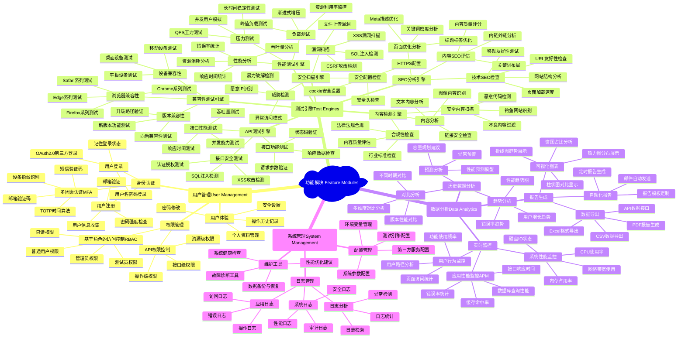
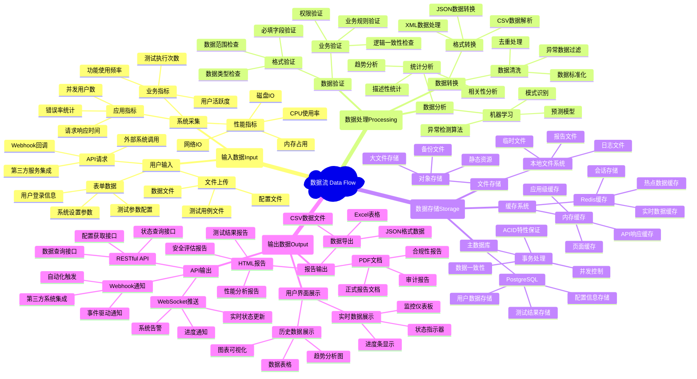
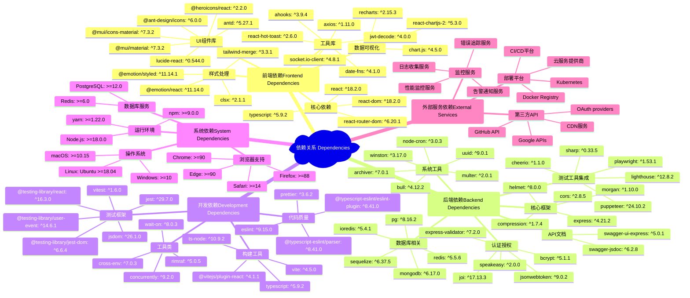

# Test-Web 项目思维导图

## 整体项目思维导图

```mermaid
mindmap
  root)Test-Web 企业级测试平台(
    (前端技术栈)
      React 18
        TypeScript 5.x
        JSX组件化
        Hooks状态管理
      构建工具
        Vite 4.x
        ESBuild
        HMR热更新
        代码分割
      UI框架
        Ant Design 5.x
        Material-UI 7.x
        TailwindCSS 3.x
        响应式设计
      状态管理
        React Context
        自定义Hooks
        本地存储
      网络通信
        Axios HTTP客户端
        WebSocket实时通信
        API代理
    
    (后端技术栈)
      Node.js运行时
        Express.js框架
        中间件架构
        RESTful API
      数据存储
        PostgreSQL主数据库
        Redis缓存
        文件存储系统
        日志存储
      认证授权
        JWT令牌
        OAuth2.0
        多因素认证MFA
        会话管理
      测试引擎
        内容检测引擎
        性能测试引擎
        SEO分析引擎
        兼容性测试引擎
        安全扫描引擎
        API测试引擎
      外部集成
        Puppeteer
        Playwright
        Lighthouse
        Chrome DevTools
    
    (核心功能模块)
      测试管理
        压力测试
          并发用户模拟
          负载测试
          性能指标收集
        内容检测
          恶意内容识别
          合规性检查
          内容质量分析
        兼容性测试
          多浏览器支持
          设备适配测试
          版本兼容性
        SEO分析
          页面优化建议
          关键词分析
          结构化数据检测
        安全扫描
          漏洞检测
          安全评估
          风险分析
      
      数据分析
        实时监控仪表板
        历史数据趋势
        性能指标统计
        自动化报告生成
        数据可视化图表
      
      用户管理
        用户注册登录
        权限控制RBAC
        个人资料管理
        操作审计日志
    
    (开发工具链)
      版本控制
        Git版本管理
        分支策略
        代码审查流程
      代码质量
        ESLint代码检查
        Prettier格式化
        TypeScript类型检查
        单元测试覆盖
      构建部署
        自动化构建
        Docker容器化
        CI/CD流水线
        多环境部署
      监控运维
        性能监控
        错误追踪
        日志分析
        健康检查
    
    (项目架构)
      分层架构
        表现层Frontend
        业务层Backend
        数据层Database
        缓存层Redis
      微服务架构
        服务拆分
        API网关
        服务发现
        负载均衡
      安全架构
        认证授权
        数据加密
        API安全
        网络安全
      监控架构
        应用监控
        基础监控
        业务监控
        告警系统
```

## 技术栈思维导图

```mermaid
mindmap
  root)技术栈 Tech Stack(
    (前端Frontend)
      核心框架
        React 18.2.0
          函数组件
          Hooks API
          Context API
          Suspense
        TypeScript 5.9.2
          静态类型检查
          接口定义
          泛型支持
          装饰器模式
      
      构建工具
        Vite 4.5.0
          极速冷启动
          HMR热更新
          ESBuild编译
          插件生态
        PostCSS
          CSS处理器
          插件系统
          自动前缀
      
      UI组件库
        Ant Design 5.27.1
          企业级组件
          主题定制
          国际化支持
        Material-UI 7.3.2
          Material Design
          组件丰富
          响应式设计
        TailwindCSS 3.3.6
          原子化CSS
          响应式工具类
          自定义主题
      
      状态管理
        React Context
        Custom Hooks
        LocalStorage
        SessionStorage
      
      网络层
        Axios 1.11.0
          HTTP客户端
          请求拦截
          响应处理
        Socket.io Client 4.8.1
          实时通信
          事件驱动
          断线重连
    
    (后端Backend)
      运行环境
        Node.js >=18.0.0
          V8引擎
          事件循环
          非阻塞IO
          ES模块支持
      
      Web框架
        Express.js 4.21.2
          中间件架构
          路由系统
          模板引擎支持
        中间件生态
          认证中间件
          验证中间件
          错误处理中间件
          日志中间件
          缓存中间件
          限流中间件
      
      数据库层
        PostgreSQL 8.16.2
          关系型数据库
          ACID特性
          复杂查询支持
          全文搜索
        Sequelize ORM 6.37.5
          模型定义
          关联关系
          迁移管理
          查询构建器
        Redis 5.5.6
          内存数据库
          缓存存储
          会话管理
          发布订阅
      
      测试工具集成
        Puppeteer 24.10.2
          Chrome控制
          页面截图
          PDF生成
          自动化测试
        Playwright 1.53.1
          多浏览器支持
          并行测试
          调试工具
        Lighthouse 12.8.2
          性能审计
          最佳实践检查
          可访问性测试
          SEO分析
    
    (开发工具DevTools)
      代码质量
        ESLint 9.15.0
          代码规范检查
          错误检测
          自动修复
        Prettier 3.6.2
          代码格式化
          一致性保证
          集成编辑器
      
      测试框架
        Vitest 1.6.0
          单元测试
          集成测试
          覆盖率报告
        Jest 29.7.0
          JavaScript测试
          模拟功能
          快照测试
      
      构建优化
        代码分割
          按路由分割
          按组件分割
          动态导入
        资源优化
          图片压缩
          CSS提取
          Tree Shaking
      
      部署运维
        Docker
          容器化部署
          多阶段构建
          镜像优化
        CI/CD
          GitHub Actions
          自动化测试
          部署流水线
```

## 功能模块思维导图

```mermaid
mindmap
  root)功能模块 Feature Modules(
    (用户管理User Management)
      身份认证
        用户注册
          邮箱验证
          密码强度检查
          用户信息收集
        用户登录
          用户名密码登录
          OAuth2.0第三方登录
          记住登录状态
        多因素认证MFA
          TOTP时间算法
          短信验证码
          邮箱验证码
          设备指纹识别
      
      权限管理
        基于角色的访问控制RBAC
          管理员权限
          普通用户权限
          测试员权限
          只读权限
        API权限控制
          接口级权限
          资源级权限
          操作级权限
      
      用户体验
        个人资料管理
        密码修改
        安全设置
        操作历史记录
    
    (测试引擎Test Engines)
      性能测试引擎
        压力测试
          并发用户模拟
          QPS压力测试
          长时间稳定性测试
        负载测试
          渐进式增压
          峰值负载测试
          资源利用率监控
        性能分析
          响应时间统计
          吞吐量分析
          错误率统计
          资源消耗分析
      
      内容检测引擎
        安全内容扫描
          恶意代码检测
          钓鱼网站识别
          不良内容过滤
        合规性检查
          法律法规合规
          行业标准检查
          内容质量评估
        内容分析
          文本内容分析
          图像内容识别
          链接安全检查
      
      兼容性测试引擎
        浏览器兼容性
          Chrome系列测试
          Firefox系列测试
          Safari系列测试
          Edge系列测试
        设备兼容性
          桌面设备测试
          移动设备测试
          平板设备测试
        版本兼容性
          新版本功能测试
          向后兼容性测试
          升级路径验证
      
      SEO分析引擎
        页面优化分析
          标题标签优化
          Meta描述优化
          关键词密度分析
        技术SEO检查
          网站结构分析
          URL友好性检查
          页面加载速度
          移动友好性测试
        内容SEO评估
          内容质量评分
          关键词布局
          内链外链分析
      
      API测试引擎
        接口功能测试
          请求参数验证
          响应数据检查
          状态码验证
        接口性能测试
          响应时间测试
          并发能力测试
          吞吐量测试
        接口安全测试
          SQL注入检测
          XSS攻击检测
          认证授权测试
      
      安全扫描引擎
        漏洞扫描
          SQL注入检测
          XSS漏洞扫描
          CSRF攻击检测
          文件上传漏洞
        安全配置检查
          HTTPS配置
          安全头检查
          cookie安全设置
        威胁检测
          恶意IP识别
          异常访问模式
          暴力破解检测
    
    (数据分析Data Analytics)
      实时监控
        系统性能监控
          CPU使用率
          内存占用率
          磁盘IO状态
          网络带宽使用
        应用性能监控APM
          接口响应时间
          数据库查询性能
          缓存命中率
          错误率统计
        用户行为监控
          页面访问统计
          功能使用频率
          用户路径分析
      
      历史数据分析
        趋势分析
          性能趋势图
          错误率趋势
          用户增长趋势
        对比分析
          版本性能对比
          不同时期对比
          多维度对比分析
        预测分析
          性能预测模型
          容量规划建议
          异常预警
      
      报告生成
        自动化报告
          定时报告生成
          邮件自动发送
          报告模板定制
        可视化图表
          折线图趋势展示
          饼图占比分析
          柱状图对比显示
          热力图分布展示
        数据导出
          Excel格式导出
          PDF报告生成
          CSV数据导出
          API数据接口
    
    (系统管理System Management)
      配置管理
        系统参数配置
        测试引擎配置
        第三方服务配置
        环境变量管理
      
      日志管理
        应用日志
          访问日志
          错误日志
          操作日志
        系统日志
          性能日志
          安全日志
          审计日志
        日志分析
          日志检索
          日志统计
          异常检测
      
      维护工具
        数据备份与恢复
        系统健康检查
        性能优化建议
        故障诊断工具
```

## 数据流思维导图

```mermaid
mindmap
  root)数据流 Data Flow(
    (输入数据Input)
      用户输入
        表单数据
          测试参数配置
          用户登录信息
          系统设置参数
        文件上传
          测试用例文件
          配置文件
          数据文件
        API请求
          外部系统调用
          第三方服务集成
          Webhook回调
      
      系统采集
        性能指标
          CPU使用率
          内存占用
          网络IO
          磁盘IO
        应用指标
          请求响应时间
          错误率统计
          并发用户数
        业务指标
          测试执行次数
          用户活跃度
          功能使用频率
    
    (数据处理Processing)
      数据验证
        格式验证
          数据类型检查
          必填字段验证
          数据范围检查
        业务验证
          逻辑一致性检查
          权限验证
          业务规则验证
      
      数据转换
        格式转换
          JSON数据转换
          CSV数据解析
          XML数据处理
        数据清洗
          去重处理
          异常数据过滤
          数据标准化
      
      数据分析
        统计分析
          描述性统计
          趋势分析
          相关性分析
        机器学习
          异常检测算法
          预测模型
          模式识别
    
    (数据存储Storage)
      主数据库
        PostgreSQL
          用户数据存储
          测试结果存储
          配置信息存储
        事务处理
          ACID特性保证
          并发控制
          数据一致性
      
      缓存系统
        Redis缓存
          会话存储
          热点数据缓存
          实时数据缓存
        内存缓存
          应用级缓存
          页面缓存
          API响应缓存
      
      文件存储
        本地文件系统
          报告文件
          日志文件
          临时文件
        对象存储
          静态资源
          备份文件
          大文件存储
    
    (输出数据Output)
      用户界面展示
        实时数据展示
          监控仪表板
          进度条显示
          状态指示器
        历史数据展示
          图表可视化
          数据表格
          趋势分析图
      
      报告输出
        HTML报告
          测试结果报告
          性能分析报告
          安全评估报告
        PDF文档
          正式报告文档
          合规性报告
          审计报告
        数据导出
          Excel表格
          CSV数据文件
          JSON格式数据
      
      API输出
        RESTful API
          数据查询接口
          状态查询接口
          配置获取接口
        WebSocket推送
          实时状态更新
          进度通知
          系统告警
        Webhook通知
          第三方系统集成
          事件驱动通知
          自动化触发
```

## 依赖关系思维导图

```mermaid
mindmap
  root)依赖关系 Dependencies(
    (前端依赖Frontend Dependencies)
      核心依赖
        react: ^18.2.0
        react-dom: ^18.2.0
        react-router-dom: ^6.20.1
        typescript: ^5.9.2
      
      UI组件库
        antd: ^5.27.1
        @ant-design/icons: ^6.0.0
        @mui/material: ^7.3.2
        @mui/icons-material: ^7.3.2
        @heroicons/react: ^2.2.0
        lucide-react: ^0.544.0
      
      样式处理
        tailwind-merge: ^3.3.1
        clsx: ^2.1.1
        @emotion/react: ^11.14.0
        @emotion/styled: ^11.14.1
      
      数据可视化
        chart.js: ^4.5.0
        react-chartjs-2: ^5.3.0
        recharts: ^2.15.3
      
      工具库
        axios: ^1.11.0
        date-fns: ^4.1.0
        jwt-decode: ^4.0.0
        socket.io-client: ^4.8.1
        ahooks: ^3.9.4
        react-hot-toast: ^2.6.0
    
    (后端依赖Backend Dependencies)
      核心框架
        express: ^4.21.2
        cors: ^2.8.5
        helmet: ^8.0.0
        compression: ^1.7.4
        morgan: ^1.10.0
      
      数据库相关
        pg: ^8.16.2
        sequelize: ^6.37.5
        redis: ^5.5.6
        ioredis: ^5.4.1
        mongodb: ^6.17.0
      
      认证授权
        jsonwebtoken: ^9.0.2
        bcrypt: ^5.1.1
        speakeasy: ^2.0.0
        joi: ^17.13.3
        express-validator: ^7.2.0
      
      测试工具集成
        puppeteer: ^24.10.2
        playwright: ^1.53.1
        lighthouse: ^12.8.2
        cheerio: ^1.1.0
        sharp: ^0.33.5
      
      系统工具
        winston: ^3.17.0
        node-cron: ^3.0.3
        bull: ^4.12.2
        archiver: ^7.0.1
        multer: ^2.0.1
        uuid: ^9.0.1
      
      API文档
        swagger-jsdoc: ^6.2.8
        swagger-ui-express: ^5.0.1
    
    (开发依赖Development Dependencies)
      构建工具
        vite: ^4.5.0
        @vitejs/plugin-react: ^4.1.1
        typescript: ^5.9.2
        ts-node: ^10.9.2
      
      代码质量
        eslint: ^9.15.0
        @typescript-eslint/eslint-plugin: ^8.41.0
        @typescript-eslint/parser: ^8.41.0
        prettier: ^3.6.2
      
      测试框架
        vitest: ^1.6.0
        jest: ^29.7.0
        @testing-library/react: ^16.3.0
        @testing-library/jest-dom: ^6.6.4
        @testing-library/user-event: ^14.6.1
        jsdom: ^26.1.0
      
      工具类
        cross-env: ^7.0.3
        concurrently: ^9.2.0
        rimraf: ^5.0.5
        wait-on: ^8.0.3
    
    (系统依赖System Dependencies)
      运行环境
        Node.js: >=18.0.0
        npm: >=9.0.0
        yarn: >=1.22.0
      
      数据库服务
        PostgreSQL: >=12.0
        Redis: >=6.0
      
      浏览器支持
        Chrome: >=90
        Firefox: >=88
        Safari: >=14
        Edge: >=90
      
      操作系统
        Windows: >=10
        macOS: >=10.15
        Linux: Ubuntu >=18.04
    
    (外部服务依赖External Services)
      第三方API
        Google APIs
        GitHub API
        OAuth providers
        CDN服务
      
      监控服务
        日志收集服务
        性能监控服务
        错误追踪服务
        告警通知服务
      
      部署平台
        Docker Registry
        Kubernetes
        CI/CD平台
        云服务提供商
```
