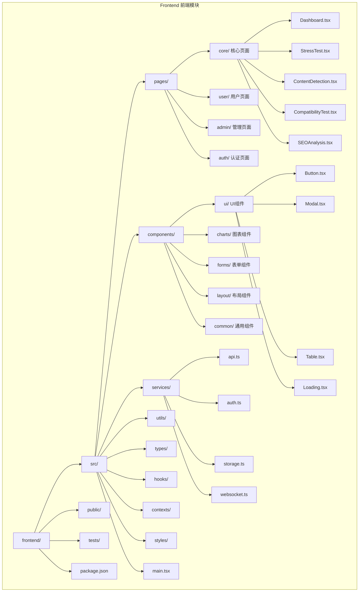
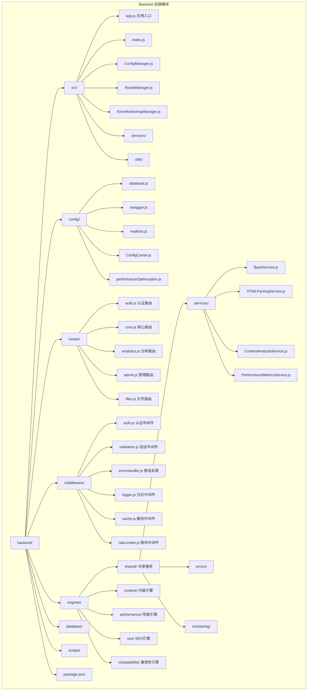
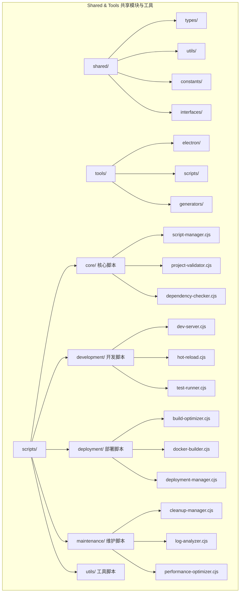
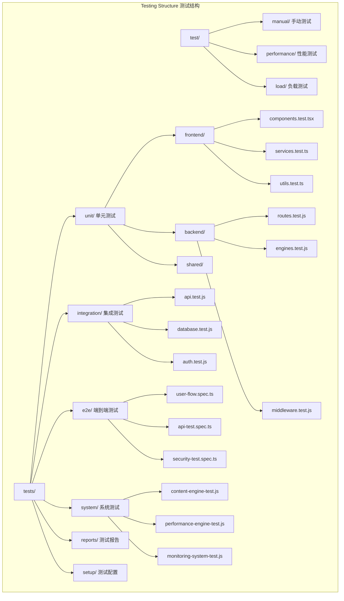
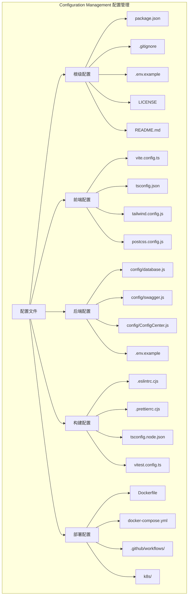
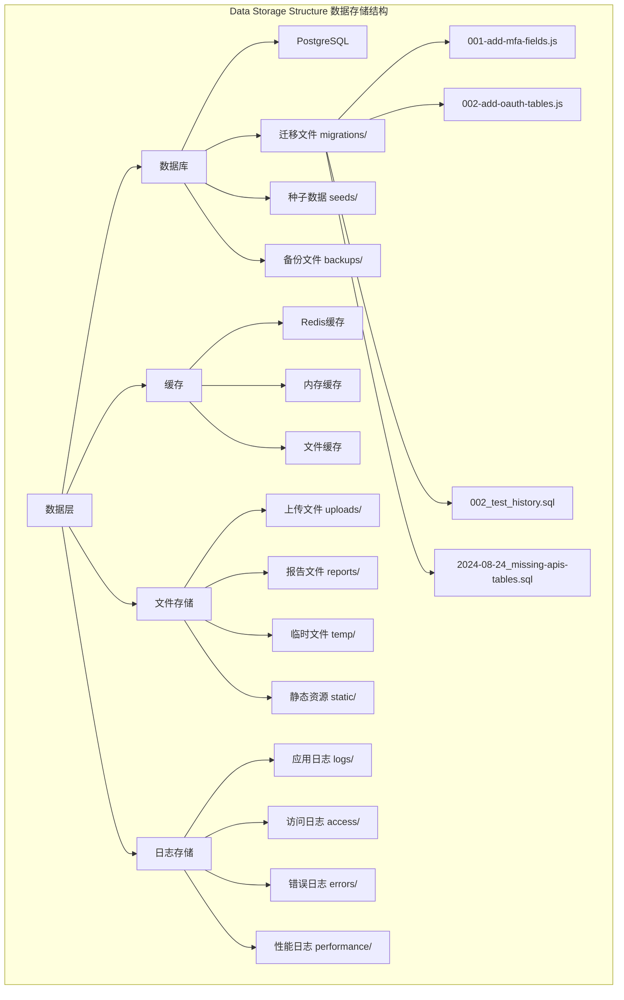
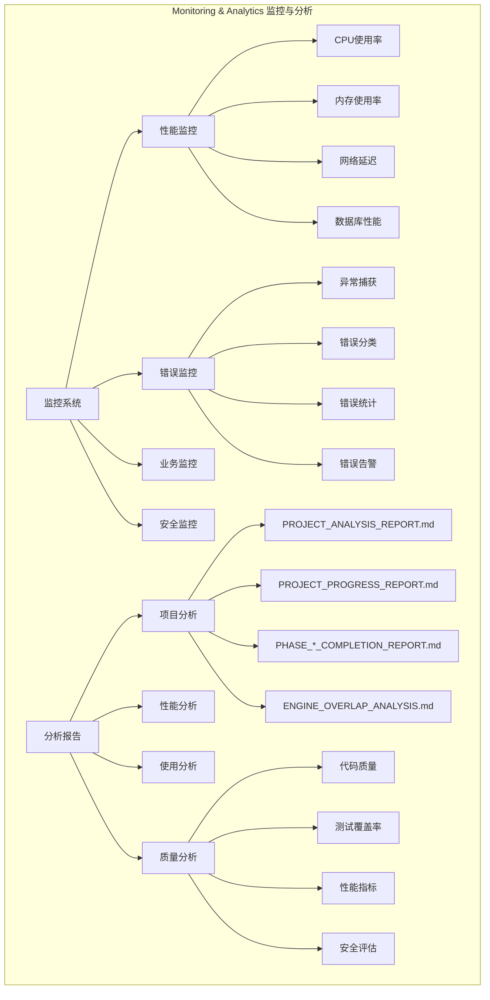

# Test-Web 项目组织结构图

## 整体项目结构层次图

```mermaid
graph TD
    A[Test-Web 根目录] --> B[前端模块 Frontend]
    A --> C[后端模块 Backend]
    A --> D[共享模块 Shared]
    A --> E[配置文件 Config]
    A --> F[文档目录 Docs]
    A --> G[脚本目录 Scripts]
    A --> H[测试目录 Tests]
    A --> I[部署配置 Deploy]
    A --> J[工具目录 Tools]
    
    %% 前端结构
    B --> B1[源码 src/]
    B --> B2[组件 components/]
    B --> B3[页面 pages/]
    B --> B4[样式 styles/]
    B --> B5[工具 utils/]
    B --> B6[类型 types/]
    B --> B7[服务 services/]
    B --> B8[钩子 hooks/]
    B --> B9[上下文 contexts/]
    
    %% 后端结构
    C --> C1[应用入口 src/app.js]
    C --> C2[路由 routes/]
    C --> C3[中间件 middleware/]
    C --> C4[控制器 controllers/]
    C --> C5[服务 services/]
    C --> C6[模型 models/]
    C --> C7[配置 config/]
    C --> C8[引擎 engines/]
    C --> C9[监控 monitoring/]
    C --> C10[数据库 database/]
    C --> C11[迁移 migrations/]
    
    %% 配置文件
    E --> E1[package.json]
    E --> E2[vite.config.ts]
    E --> E3[tsconfig.json]
    E --> E4[.eslintrc.cjs]
    E --> E5[.prettierrc.cjs]
    E --> E6[环境配置 .env.*]
    
    %% 测试目录
    H --> H1[单元测试 unit/]
    H --> H2[集成测试 integration/]
    H --> H3[端到端测试 e2e/]
    H --> H4[系统测试 system/]
    H --> H5[测试报告 reports/]
    
    %% 部署配置
    I --> I1[Docker配置 Dockerfile]
    I --> I2[K8s配置 k8s/]
    I --> I3[CI/CD .github/workflows/]
    I --> I4[Nginx配置]
```

## 前端模块详细结构

```mermaid
graph TB
    subgraph "Frontend 前端模块"
        A[frontend/] --> B[src/]
        A --> C[public/]
        A --> D[tests/]
        A --> E[package.json]
        
        B --> F[pages/]
        B --> G[components/]
        B --> H[services/]
        B --> I[utils/]
        B --> J[types/]
        B --> K[hooks/]
        B --> L[contexts/]
        B --> M[styles/]
        B --> N[main.tsx]
        
        %% 页面结构
        F --> F1[core/ 核心页面]
        F --> F2[user/ 用户页面]
        F --> F3[admin/ 管理页面]
        F --> F4[auth/ 认证页面]
        
        F1 --> F11[Dashboard.tsx]
        F1 --> F12[StressTest.tsx]
        F1 --> F13[ContentDetection.tsx]
        F1 --> F14[CompatibilityTest.tsx]
        F1 --> F15[SEOAnalysis.tsx]
        
        %% 组件结构
        G --> G1[ui/ UI组件]
        G --> G2[charts/ 图表组件]
        G --> G3[forms/ 表单组件]
        G --> G4[layout/ 布局组件]
        G --> G5[common/ 通用组件]
        
        G1 --> G11[Button.tsx]
        G1 --> G12[Modal.tsx]
        G1 --> G13[Table.tsx]
        G1 --> G14[Loading.tsx]
        
        %% 服务结构
        H --> H1[api.ts]
        H --> H2[auth.ts]
        H --> H3[storage.ts]
        H --> H4[websocket.ts]
    end
```

## 后端模块详细结构

```mermaid
graph TB
    subgraph "Backend 后端模块"
        A[backend/] --> B[src/]
        A --> C[config/]
        A --> D[routes/]
        A --> E[middleware/]
        A --> F[engines/]
        A --> G[database/]
        A --> H[scripts/]
        A --> I[package.json]
        
        B --> B1[app.js 应用入口]
        B --> B2[index.js]
        B --> B3[ConfigManager.js]
        B --> B4[RouteManager.js]
        B --> B5[ErrorMonitoringManager.js]
        B --> B6[services/]
        B --> B7[utils/]
        
        %% 配置结构
        C --> C1[database.js]
        C --> C2[swagger.js]
        C --> C3[realtime.js]
        C --> C4[ConfigCenter.js]
        C --> C5[performanceOptimization.js]
        
        %% 路由结构
        D --> D1[auth.js 认证路由]
        D --> D2[core.js 核心路由]
        D --> D3[analytics.js 分析路由]
        D --> D4[admin.js 管理路由]
        D --> D5[files.js 文件路由]
        
        %% 中间件结构
        E --> E1[auth.js 认证中间件]
        E --> E2[validation.js 验证中间件]
        E --> E3[errorHandler.js 错误处理]
        E --> E4[logger.js 日志中间件]
        E --> E5[cache.js 缓存中间件]
        E --> E6[rateLimiter.js 限流中间件]
        
        %% 测试引擎结构
        F --> F1[shared/ 共享服务]
        F --> F2[content/ 内容引擎]
        F --> F3[performance/ 性能引擎]
        F --> F4[seo/ SEO引擎]
        F --> F5[compatibility/ 兼容性引擎]
        
        F1 --> F11[services/]
        F1 --> F12[errors/]
        F1 --> F13[monitoring/]
        
        F11 --> F111[BaseService.js]
        F11 --> F112[HTMLParsingService.js]
        F11 --> F113[ContentAnalysisService.js]
        F11 --> F114[PerformanceMetricsService.js]
    end
```

## 共享模块与工具结构

```mermaid
graph TB
    subgraph "Shared & Tools 共享模块与工具"
        A[shared/] --> A1[types/]
        A --> A2[utils/]
        A --> A3[constants/]
        A --> A4[interfaces/]
        
        B[tools/] --> B1[electron/]
        B --> B2[scripts/]
        B --> B3[generators/]
        
        C[scripts/] --> C1[core/ 核心脚本]
        C --> C2[development/ 开发脚本]
        C --> C3[deployment/ 部署脚本]
        C --> C4[maintenance/ 维护脚本]
        C --> C5[utils/ 工具脚本]
        
        %% 核心脚本详细
        C1 --> C11[script-manager.cjs]
        C1 --> C12[project-validator.cjs]
        C1 --> C13[dependency-checker.cjs]
        
        %% 开发脚本详细
        C2 --> C21[dev-server.cjs]
        C2 --> C22[hot-reload.cjs]
        C2 --> C23[test-runner.cjs]
        
        %% 部署脚本详细
        C3 --> C31[build-optimizer.cjs]
        C3 --> C32[docker-builder.cjs]
        C3 --> C33[deployment-manager.cjs]
        
        %% 维护脚本详细
        C4 --> C41[cleanup-manager.cjs]
        C4 --> C42[log-analyzer.cjs]
        C4 --> C43[performance-optimizer.cjs]
    end
```

## 测试结构组织图

```mermaid
graph TB
    subgraph "Testing Structure 测试结构"
        A[tests/] --> A1[unit/ 单元测试]
        A --> A2[integration/ 集成测试]
        A --> A3[e2e/ 端到端测试]
        A --> A4[system/ 系统测试]
        A --> A5[reports/ 测试报告]
        A --> A6[setup/ 测试配置]
        
        B[test/] --> B1[manual/ 手动测试]
        B --> B2[performance/ 性能测试]
        B --> B3[load/ 负载测试]
        
        %% 单元测试详细
        A1 --> A11[frontend/]
        A1 --> A12[backend/]
        A1 --> A13[shared/]
        
        A11 --> A111[components.test.tsx]
        A11 --> A112[services.test.ts]
        A11 --> A113[utils.test.ts]
        
        A12 --> A121[routes.test.js]
        A12 --> A122[engines.test.js]
        A12 --> A123[middleware.test.js]
        
        %% 集成测试详细
        A2 --> A21[api.test.js]
        A2 --> A22[database.test.js]
        A2 --> A23[auth.test.js]
        
        %% E2E测试详细
        A3 --> A31[user-flow.spec.ts]
        A3 --> A32[api-test.spec.ts]
        A3 --> A33[security-test.spec.ts]
        
        %% 系统测试详细
        A4 --> A41[content-engine-test.js]
        A4 --> A42[performance-engine-test.js]
        A4 --> A43[monitoring-system-test.js]
    end
```

## 配置管理结构

```mermaid
graph TB
    subgraph "Configuration Management 配置管理"
        A[配置文件] --> A1[根级配置]
        A --> A2[前端配置]
        A --> A3[后端配置]
        A --> A4[构建配置]
        A --> A5[部署配置]
        
        %% 根级配置
        A1 --> A11[package.json]
        A1 --> A12[.gitignore]
        A1 --> A13[.env.example]
        A1 --> A14[LICENSE]
        A1 --> A15[README.md]
        
        %% 前端配置
        A2 --> A21[vite.config.ts]
        A2 --> A22[tsconfig.json]
        A2 --> A23[tailwind.config.js]
        A2 --> A24[postcss.config.js]
        
        %% 后端配置
        A3 --> A31[config/database.js]
        A3 --> A32[config/swagger.js]
        A3 --> A33[config/ConfigCenter.js]
        A3 --> A34[.env.example]
        
        %% 构建配置
        A4 --> A41[.eslintrc.cjs]
        A4 --> A42[.prettierrc.cjs]
        A4 --> A43[tsconfig.node.json]
        A4 --> A44[vitest.config.ts]
        
        %% 部署配置
        A5 --> A51[Dockerfile]
        A5 --> A52[docker-compose.yml]
        A5 --> A53[.github/workflows/]
        A5 --> A54[k8s/]
    end
```

## 数据存储结构

```mermaid
graph TB
    subgraph "Data Storage Structure 数据存储结构"
        A[数据层] --> A1[数据库]
        A --> A2[缓存]
        A --> A3[文件存储]
        A --> A4[日志存储]
        
        %% 数据库结构
        A1 --> A11[PostgreSQL]
        A1 --> A12[迁移文件 migrations/]
        A1 --> A13[种子数据 seeds/]
        A1 --> A14[备份文件 backups/]
        
        A12 --> A121[001-add-mfa-fields.js]
        A12 --> A122[002-add-oauth-tables.js]
        A12 --> A123[002_test_history.sql]
        A12 --> A124[2024-08-24_missing-apis-tables.sql]
        
        %% 缓存结构
        A2 --> A21[Redis缓存]
        A2 --> A22[内存缓存]
        A2 --> A23[文件缓存]
        
        %% 文件存储结构
        A3 --> A31[上传文件 uploads/]
        A3 --> A32[报告文件 reports/]
        A3 --> A33[临时文件 temp/]
        A3 --> A34[静态资源 static/]
        
        %% 日志存储结构
        A4 --> A41[应用日志 logs/]
        A4 --> A42[访问日志 access/]
        A4 --> A43[错误日志 errors/]
        A4 --> A44[性能日志 performance/]
    end
```

## 监控与分析结构

```mermaid
graph TB
    subgraph "Monitoring & Analytics 监控与分析"
        A[监控系统] --> A1[性能监控]
        A --> A2[错误监控]
        A --> A3[业务监控]
        A --> A4[安全监控]
        
        B[分析报告] --> B1[项目分析]
        B --> B2[性能分析]
        B --> B3[使用分析]
        B --> B4[质量分析]
        
        %% 性能监控
        A1 --> A11[CPU使用率]
        A1 --> A12[内存使用率]
        A1 --> A13[网络延迟]
        A1 --> A14[数据库性能]
        
        %% 错误监控
        A2 --> A21[异常捕获]
        A2 --> A22[错误分类]
        A2 --> A23[错误统计]
        A2 --> A24[错误告警]
        
        %% 项目分析
        B1 --> B11[PROJECT_ANALYSIS_REPORT.md]
        B1 --> B12[PROJECT_PROGRESS_REPORT.md]
        B1 --> B13[PHASE_*_COMPLETION_REPORT.md]
        B1 --> B14[ENGINE_OVERLAP_ANALYSIS.md]
        
        %% 质量分析
        B4 --> B41[代码质量]
        B4 --> B42[测试覆盖率]
        B4 --> B43[性能指标]
        B4 --> B44[安全评估]
    end
```
