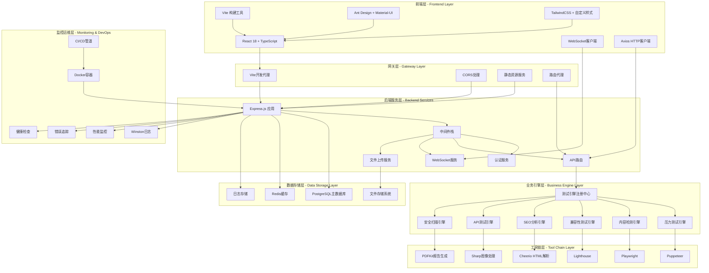
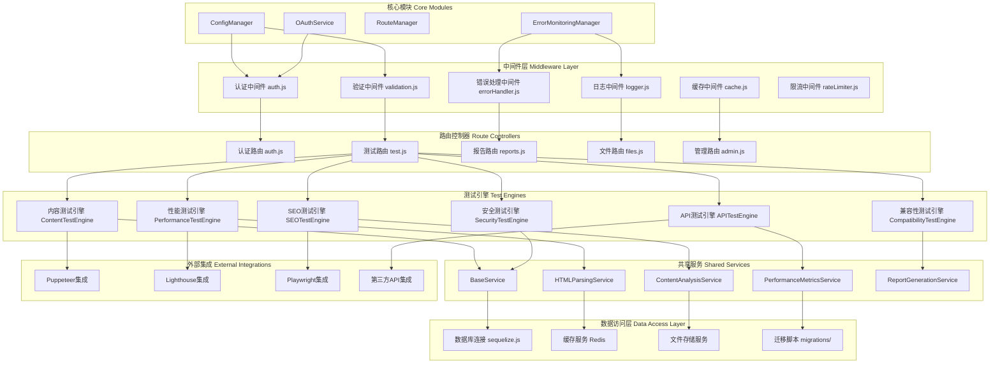
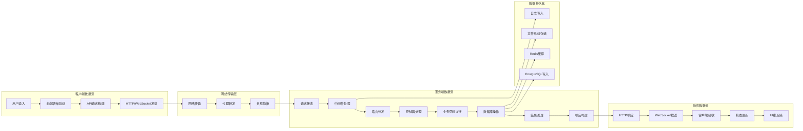
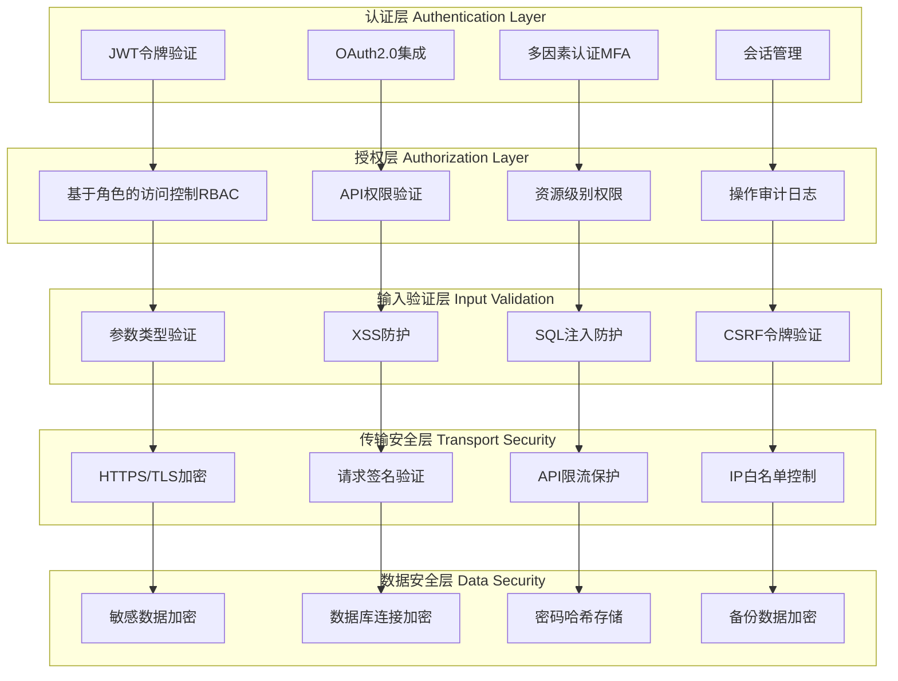
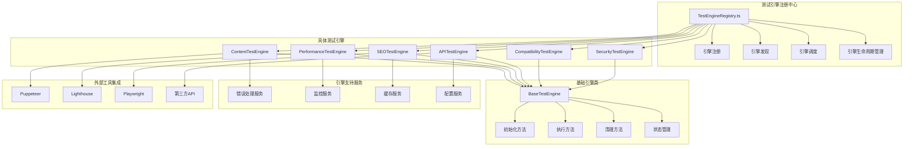
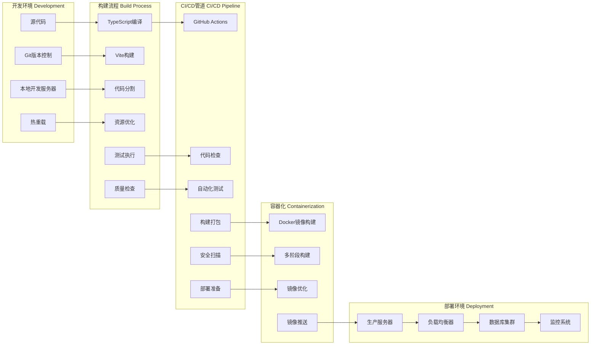

# Test-Web 技术架构流程图

## 整体技术架构

```mermaid
graph TB
    subgraph "前端层 - Frontend Layer"
        A[React 18 + TypeScript]
        B[Vite 构建工具]
        C[Ant Design + Material-UI]
        D[TailwindCSS + 自定义样式]
        E[WebSocket客户端]
        F[Axios HTTP客户端]
    end

    subgraph "网关层 - Gateway Layer"
        G[Vite开发代理]
        H[CORS处理]
        I[静态资源服务]
        J[路由代理]
    end

    subgraph "后端服务层 - Backend Services"
        K[Express.js 应用]
        L[中间件栈]
        M[认证服务]
        N[API路由]
        O[WebSocket服务]
        P[文件上传服务]
    end

    subgraph "业务引擎层 - Business Engine Layer"
        Q[测试引擎注册中心]
        R[压力测试引擎]
        S[内容检测引擎]
        T[兼容性测试引擎]
        U[SEO分析引擎]
        V[API测试引擎]
        W[安全扫描引擎]
    end

    subgraph "工具链层 - Tool Chain Layer"
        X[Puppeteer]
        Y[Playwright]
        Z[Lighthouse]
        AA[Cheerio HTML解析]
        BB[Sharp图像处理]
        CC[PDFKit报告生成]
    end

    subgraph "数据存储层 - Data Storage Layer"
        DD[PostgreSQL主数据库]
        EE[Redis缓存]
        FF[文件存储系统]
        GG[日志存储]
    end

    subgraph "监控运维层 - Monitoring & DevOps"
        HH[Winston日志]
        II[性能监控]
        JJ[错误追踪]
        KK[健康检查]
        LL[Docker容器]
        MM[CI/CD管道]
    end

    %% 连接关系
    A --> G
    B --> A
    C --> A
    D --> A
    E --> O
    F --> N
    
    G --> K
    H --> K
    I --> K
    J --> N
    
    K --> L
    L --> M
    L --> N
    L --> O
    L --> P
    
    N --> Q
    Q --> R
    Q --> S
    Q --> T
    Q --> U
    Q --> V
    Q --> W
    
    R --> X
    S --> Y
    T --> Z
    U --> AA
    V --> BB
    W --> CC
    
    K --> DD
    K --> EE
    P --> FF
    K --> GG
    
    K --> HH
    K --> II
    K --> JJ
    K --> KK
    LL --> K
    MM --> LL
```

## 模块依赖关系架构

```mermaid
graph TD
    subgraph "核心模块 Core Modules"
        A1[ConfigManager]
        A2[ErrorMonitoringManager]
        A3[RouteManager]
        A4[OAuthService]
    end

    subgraph "中间件层 Middleware Layer"
        B1[认证中间件 auth.js]
        B2[验证中间件 validation.js]
        B3[错误处理中间件 errorHandler.js]
        B4[日志中间件 logger.js]
        B5[缓存中间件 cache.js]
        B6[限流中间件 rateLimiter.js]
    end

    subgraph "路由控制器 Route Controllers"
        C1[认证路由 auth.js]
        C2[测试路由 test.js]
        C3[报告路由 reports.js]
        C4[文件路由 files.js]
        C5[管理路由 admin.js]
    end

    subgraph "测试引擎 Test Engines"
        D1[内容测试引擎 ContentTestEngine]
        D2[性能测试引擎 PerformanceTestEngine]
        D3[SEO测试引擎 SEOTestEngine]
        D4[API测试引擎 APITestEngine]
        D5[兼容性测试引擎 CompatibilityTestEngine]
        D6[安全测试引擎 SecurityTestEngine]
    end

    subgraph "共享服务 Shared Services"
        E1[BaseService]
        E2[HTMLParsingService]
        E3[ContentAnalysisService]
        E4[PerformanceMetricsService]
        E5[ReportGenerationService]
    end

    subgraph "数据访问层 Data Access Layer"
        F1[数据库连接 sequelize.js]
        F2[缓存服务 Redis]
        F3[文件存储服务]
        F4[迁移脚本 migrations/]
    end

    subgraph "外部集成 External Integrations"
        G1[Puppeteer集成]
        G2[Lighthouse集成]
        G3[Playwright集成]
        G4[第三方API集成]
    end

    %% 依赖关系
    A1 --> B1
    A1 --> B2
    A2 --> B3
    A2 --> B4
    A4 --> B1
    
    B1 --> C1
    B2 --> C2
    B3 --> C3
    B4 --> C4
    B5 --> C5
    
    C2 --> D1
    C2 --> D2
    C2 --> D3
    C2 --> D4
    C2 --> D5
    C2 --> D6
    
    D1 --> E1
    D2 --> E2
    D3 --> E3
    D4 --> E4
    D5 --> E5
    D6 --> E1
    
    E1 --> F1
    E2 --> F2
    E3 --> F3
    E4 --> F4
    
    D1 --> G1
    D2 --> G2
    D3 --> G3
    D4 --> G4
```

## 数据流架构

```mermaid
graph LR
    subgraph "客户端数据流"
        A[用户输入] --> B[前端表单验证]
        B --> C[API请求构建]
        C --> D[HTTP/WebSocket发送]
    end

    subgraph "网络传输层"
        D --> E[网络传输]
        E --> F[代理转发]
        F --> G[负载均衡]
    end

    subgraph "服务端数据流"
        G --> H[请求接收]
        H --> I[中间件处理]
        I --> J[路由分发]
        J --> K[控制器处理]
        K --> L[业务逻辑执行]
        L --> M[数据库操作]
        M --> N[结果处理]
        N --> O[响应构建]
    end

    subgraph "数据持久化"
        P[PostgreSQL写入]
        Q[Redis缓存]
        R[文件系统存储]
        S[日志写入]
    end

    subgraph "响应数据流"
        O --> T[HTTP响应]
        T --> U[WebSocket推送]
        U --> V[客户端接收]
        V --> W[状态更新]
        W --> X[UI重渲染]
    end

    %% 数据存储连接
    M --> P
    M --> Q
    M --> R
    I --> S
```

## 安全架构流程

```mermaid
graph TD
    subgraph "认证层 Authentication Layer"
        A1[JWT令牌验证]
        A2[OAuth2.0集成]
        A3[多因素认证MFA]
        A4[会话管理]
    end

    subgraph "授权层 Authorization Layer"
        B1[基于角色的访问控制RBAC]
        B2[API权限验证]
        B3[资源级别权限]
        B4[操作审计日志]
    end

    subgraph "输入验证层 Input Validation"
        C1[参数类型验证]
        C2[XSS防护]
        C3[SQL注入防护]
        C4[CSRF令牌验证]
    end

    subgraph "传输安全层 Transport Security"
        D1[HTTPS/TLS加密]
        D2[请求签名验证]
        D3[API限流保护]
        D4[IP白名单控制]
    end

    subgraph "数据安全层 Data Security"
        E1[敏感数据加密]
        E2[数据库连接加密]
        E3[密码哈希存储]
        E4[备份数据加密]
    end

    %% 安全流程连接
    A1 --> B1
    A2 --> B2
    A3 --> B3
    A4 --> B4
    
    B1 --> C1
    B2 --> C2
    B3 --> C3
    B4 --> C4
    
    C1 --> D1
    C2 --> D2
    C3 --> D3
    C4 --> D4
    
    D1 --> E1
    D2 --> E2
    D3 --> E3
    D4 --> E4
```

## 测试引擎架构

```mermaid
graph TB
    subgraph "测试引擎注册中心"
        A[TestEngineRegistry.ts]
        A --> A1[引擎注册]
        A --> A2[引擎发现]
        A --> A3[引擎调度]
        A --> A4[引擎生命周期管理]
    end

    subgraph "基础引擎类"
        B[BaseTestEngine]
        B --> B1[初始化方法]
        B --> B2[执行方法]
        B --> B3[清理方法]
        B --> B4[状态管理]
    end

    subgraph "具体测试引擎"
        C1[ContentTestEngine] --> B
        C2[PerformanceTestEngine] --> B  
        C3[SEOTestEngine] --> B
        C4[APITestEngine] --> B
        C5[CompatibilityTestEngine] --> B
        C6[SecurityTestEngine] --> B
    end

    subgraph "引擎支持服务"
        D1[错误处理服务]
        D2[监控服务] 
        D3[缓存服务]
        D4[配置服务]
    end

    subgraph "外部工具集成"
        E1[Puppeteer]
        E2[Lighthouse]
        E3[Playwright]
        E4[第三方API]
    end

    %% 连接关系
    A --> C1
    A --> C2
    A --> C3
    A --> C4
    A --> C5
    A --> C6
    
    C1 --> D1
    C2 --> D2
    C3 --> D3
    C4 --> D4
    
    C1 --> E1
    C2 --> E2
    C3 --> E3
    C4 --> E4
```

## 构建与部署架构

```mermaid
graph LR
    subgraph "开发环境 Development"
        A1[源代码]
        A2[Git版本控制]
        A3[本地开发服务器]
        A4[热重载]
    end

    subgraph "构建流程 Build Process"
        B1[TypeScript编译]
        B2[Vite构建]
        B3[代码分割]
        B4[资源优化]
        B5[测试执行]
        B6[质量检查]
    end

    subgraph "CI/CD管道 CI/CD Pipeline"
        C1[GitHub Actions]
        C2[代码检查]
        C3[自动化测试]
        C4[构建打包]
        C5[安全扫描]
        C6[部署准备]
    end

    subgraph "容器化 Containerization"
        D1[Docker镜像构建]
        D2[多阶段构建]
        D3[镜像优化]
        D4[镜像推送]
    end

    subgraph "部署环境 Deployment"
        E1[生产服务器]
        E2[负载均衡器]
        E3[数据库集群]
        E4[监控系统]
    end

    %% 流程连接
    A1 --> B1
    A2 --> B2
    A3 --> B3
    A4 --> B4
    
    B1 --> C1
    B5 --> C2
    B6 --> C3
    
    C4 --> D1
    C5 --> D2
    C6 --> D3
    
    D4 --> E1
    E1 --> E2
    E2 --> E3
    E3 --> E4
```
