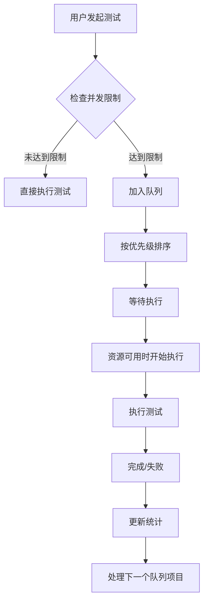

# 压力测试队列功能实现文档

## 🎯 功能概述

实现了完整的压力测试队列管理系统，支持测试排队、优先级调度、资源控制和状态监控，移除了暂停功能以简化系统复杂度。

## 📋 核心功能

### 1. 队列管理
- ✅ **测试排队**: 当并发测试达到上限时自动排队
- ✅ **优先级调度**: 支持高、中、低三级优先级
- ✅ **资源控制**: 限制最大并发测试数量
- ✅ **超时处理**: 自动清理超时的队列项目
- ✅ **重试机制**: 失败测试自动重试

### 2. 状态管理
- ✅ **实时统计**: 队列长度、运行中、已完成、失败数量
- ✅ **等待时间估算**: 基于历史数据预测等待时间
- ✅ **位置跟踪**: 显示测试在队列中的位置
- ✅ **事件通知**: 队列状态变化实时通知

### 3. 用户界面
- ✅ **队列状态面板**: 显示详细的队列统计信息
- ✅ **排队提示**: 测试排队时的友好提示
- ✅ **进度跟踪**: 实时显示测试执行进度
- ✅ **取消操作**: 支持取消排队中的测试

## 🏗️ 架构设计

### 核心组件

#### 1. StressTestQueueManager (`src/services/stressTestQueueManager.ts`)
```typescript
class StressTestQueueManager {
  // 队列配置
  private config: QueueConfig = {
    maxConcurrentTests: 3,      // 最大并发测试数
    maxQueueSize: 20,           // 最大队列长度
    queueTimeout: 30 * 60 * 1000, // 队列超时时间
    retryDelay: 5000,           // 重试延迟
    priorityWeights: {          // 优先级权重
      high: 3,
      normal: 2,
      low: 1
    }
  };

  // 核心方法
  async enqueueTest(testData, priority): Promise<string>
  async cancelQueuedTest(queueId, reason): Promise<boolean>
  getQueueStats(): QueueStats
  getQueuePosition(queueId): number
  estimateWaitTime(queueId): number
}
```

#### 2. useStressTestRecord Hook 增强 (`src/hooks/useStressTestRecord.ts`)
```typescript
export interface UseStressTestRecordReturn {
  // 原有功能...
  
  // 新增队列功能
  queueStats: QueueStats;
  currentQueueId: string | null;
  enqueueTest: (testData, priority?) => Promise<string>;
  cancelQueuedTest: (queueId, reason?) => Promise<boolean>;
  getQueuePosition: (queueId) => number;
  estimateWaitTime: (queueId) => number;
}
```

#### 3. StressTestQueueStatus 组件 (`src/components/stress/StressTestQueueStatus.tsx`)
```typescript
interface StressTestQueueStatusProps {
  queueStats: QueueStats;
  currentQueueId?: string | null;
  queuePosition?: number;
  estimatedWaitTime?: number;
}
```

### 数据流



## 🔧 配置选项

### 队列配置
```typescript
interface QueueConfig {
  maxConcurrentTests: number;    // 最大并发测试数 (默认: 3)
  maxQueueSize: number;          // 最大队列长度 (默认: 20)
  queueTimeout: number;          // 队列超时时间 (默认: 30分钟)
  retryDelay: number;            // 重试延迟 (默认: 5秒)
  priorityWeights: {             // 优先级权重
    high: number;                // 高优先级权重 (默认: 3)
    normal: number;              // 普通优先级权重 (默认: 2)
    low: number;                 // 低优先级权重 (默认: 1)
  };
}
```

### 测试状态
```typescript
type TestStatus = 
  | 'pending'    // 准备中
  | 'waiting'    // 排队等待
  | 'running'    // 执行中
  | 'completed'  // 已完成
  | 'failed'     // 已失败
  | 'cancelled'  // 已取消
  | 'timeout';   // 已超时
```

## 📊 使用示例

### 1. 基本队列操作
```typescript
// 添加测试到队列
const queueId = await enqueueTest({
  testName: '压力测试',
  url: 'https://example.com',
  config: { users: 100, duration: 60 }
}, 'normal');

// 获取队列位置
const position = getQueuePosition(queueId);

// 估算等待时间
const waitTime = estimateWaitTime(queueId);

// 取消队列中的测试
await cancelQueuedTest(queueId, '用户取消');
```

### 2. 队列状态监控
```typescript
// 获取队列统计
const stats = queueStats;
console.log(`队列长度: ${stats.queueLength}`);
console.log(`运行中: ${stats.totalRunning}`);
console.log(`平均等待时间: ${stats.averageWaitTime}秒`);
```

### 3. 优先级设置
```typescript
// 高优先级测试（紧急）
await enqueueTest(testData, 'high');

// 普通优先级测试（默认）
await enqueueTest(testData, 'normal');

// 低优先级测试（后台）
await enqueueTest(testData, 'low');
```

## 🚀 部署和配置

### 1. 环境变量
```env
# 队列配置
STRESS_TEST_MAX_CONCURRENT=3
STRESS_TEST_MAX_QUEUE_SIZE=20
STRESS_TEST_QUEUE_TIMEOUT=1800000
STRESS_TEST_RETRY_DELAY=5000
```

### 2. 系统要求
- **CPU**: 建议4核以上，支持更高并发
- **内存**: 建议8GB以上，保证队列稳定运行
- **网络**: 稳定的网络连接，避免测试中断

### 3. 监控指标
- 队列长度趋势
- 平均等待时间
- 测试成功率
- 系统资源使用率

## 🔍 故障排除

### 常见问题

1. **队列满了怎么办？**
   - 增加 `maxQueueSize` 配置
   - 优化测试执行时间
   - 增加并发测试数量

2. **等待时间过长？**
   - 检查系统资源使用情况
   - 优化测试配置
   - 考虑增加并发数量

3. **测试频繁失败？**
   - 检查网络连接
   - 验证目标服务器状态
   - 调整重试策略

### 日志监控
```typescript
// 队列事件日志
stressTestQueueManager.addListener((event, data) => {
  console.log(`队列事件: ${event}`, data);
  // 发送到监控系统
});
```

## 📈 性能优化

### 1. 队列优化
- 合理设置并发数量
- 优化优先级算法
- 实现智能调度

### 2. 资源管理
- 监控系统资源使用
- 动态调整并发限制
- 实现负载均衡

### 3. 用户体验
- 准确的等待时间预估
- 实时的进度更新
- 友好的错误提示

## 🔮 未来扩展

### 计划功能
1. **分布式队列**: 支持多服务器队列
2. **智能调度**: 基于AI的资源调度
3. **高级监控**: 详细的性能分析
4. **API集成**: 第三方系统集成

### 扩展点
- 自定义调度算法
- 插件化队列处理器
- 多租户队列隔离
- 实时性能分析

通过这个队列系统，压力测试现在可以更好地管理资源，提供更稳定的服务，同时为用户提供清晰的排队状态和预期等待时间。
