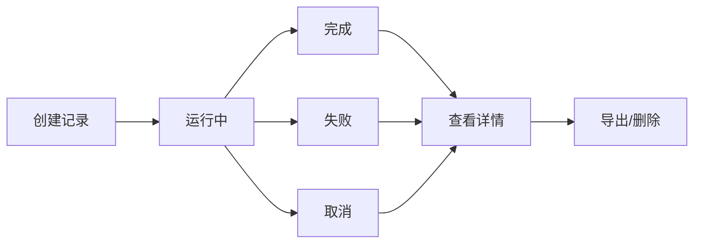

# 压力测试记录功能完善

## 概述

本次更新完善了压力测试中的测试记录管理功能，提供了完整的测试记录生命周期管理，包括创建、更新、查询、完成和删除等操作。

## 新增功能

### 1. 压力测试记录服务 (`stressTestRecordService`)

**文件位置**: `src/services/stressTestRecordService.ts`

**主要功能**:
- 创建测试记录
- 更新测试记录状态和数据
- 完成测试记录（保存结果和评分）
- 标记测试失败
- 查询测试记录（支持分页、排序、过滤）
- 删除测试记录

**接口定义**:
```typescript
interface StressTestRecord {
  id: string;
  testName: string;
  url: string;
  status: 'pending' | 'running' | 'completed' | 'failed' | 'cancelled';
  startTime: string;
  endTime?: string;
  config: TestConfig;
  results?: TestResults;
  overallScore?: number;
  // ... 更多字段
}
```

### 2. 测试记录管理 Hook (`useStressTestRecord`)

**文件位置**: `src/hooks/useStressTestRecord.ts`

**主要功能**:
- 状态管理（记录列表、当前记录、加载状态等）
- 记录操作方法（CRUD操作）
- 实时更新支持
- 自动刷新和缓存管理

**使用示例**:
```typescript
const {
  records,
  currentRecord,
  createRecord,
  updateRecord,
  completeRecord,
  failRecord,
  loadRecords
} = useStressTestRecord();
```

### 3. 测试记录详情组件 (`StressTestRecordDetail`)

**文件位置**: `src/components/stress/StressTestRecordDetail.tsx`

**主要功能**:
- 显示测试记录的详细信息
- 性能指标可视化
- 测试配置展示
- 错误信息显示
- 导出和操作功能

### 4. 后端 API 增强

**文件位置**: `server/routes/test.js`

**新增路由**:
- `POST /api/test/history` - 创建测试记录
- `PUT /api/test/history/:id` - 更新测试记录
- `GET /api/test/history/:id` - 获取单个测试记录
- `DELETE /api/test/history/:id` - 删除测试记录

**增强的 testHistoryService**:
- 支持更灵活的更新操作
- 改进的数据格式化
- 更好的错误处理

## 功能特性

### 1. 完整的生命周期管理



### 2. 实时状态更新

- 测试进度跟踪
- 实时数据收集
- 状态同步

### 3. 丰富的查询功能

- 分页查询
- 多字段排序
- 状态过滤
- 时间范围筛选
- 关键词搜索

### 4. 数据完整性

- 自动时间戳
- 数据验证
- 错误处理
- 事务支持

## 集成到压力测试页面

### 1. 测试启动时创建记录

```typescript
// 创建测试记录
const recordId = await startRecording({
  testName: `压力测试 - ${hostname}`,
  url: testConfig.url,
  config: testConfig
});
```

### 2. 测试完成时更新记录

```typescript
// 完成测试记录
await completeRecord(recordId, {
  metrics: testResults.metrics,
  realTimeData: testResults.realTimeData
}, overallScore);
```

### 3. 测试失败时标记记录

```typescript
// 标记测试失败
await failRecord(recordId, error.message);
```

## 数据结构

### 测试配置 (TestConfig)
```typescript
interface TestConfig {
  users: number;           // 并发用户数
  duration: number;        // 测试持续时间
  rampUpTime: number;      // 爬坡时间
  testType: string;        // 测试类型
  method: string;          // HTTP方法
  timeout: number;         // 超时时间
  thinkTime: number;       // 思考时间
}
```

### 测试结果 (TestResults)
```typescript
interface TestResults {
  metrics: {
    totalRequests: number;
    successfulRequests: number;
    failedRequests: number;
    averageResponseTime: number;
    throughput: number;
    errorRate: number;
    // ... 更多指标
  };
  realTimeData: Array<{
    timestamp: number;
    responseTime: number;
    throughput: number;
    activeUsers: number;
    errors: number;
    errorRate: number;
    phase: string;
  }>;
}
```

## 使用指南

### 1. 基本使用

```typescript
import { useStressTestRecord } from '../hooks/useStressTestRecord';

const MyComponent = () => {
  const {
    records,
    createRecord,
    updateRecord,
    completeRecord
  } = useStressTestRecord();

  const handleStartTest = async () => {
    const record = await createRecord({
      testName: '我的压力测试',
      url: 'https://example.com',
      config: { /* 测试配置 */ }
    });
    
    // 开始测试...
  };

  return (
    <div>
      {/* UI 组件 */}
    </div>
  );
};
```

### 2. 查询和过滤

```typescript
const { loadRecords } = useStressTestRecord();

// 查询最近的测试记录
await loadRecords({
  page: 1,
  limit: 10,
  status: 'completed',
  sortBy: 'createdAt',
  sortOrder: 'desc'
});
```

### 3. 实时更新

```typescript
const { updateProgress, addRealTimeData } = useStressTestRecord();

// 更新测试进度
await updateProgress(recordId, 75, 'steady-state');

// 添加实时数据点
await addRealTimeData(recordId, {
  timestamp: Date.now(),
  responseTime: 250,
  throughput: 33.3,
  activeUsers: 10
});
```

## 测试验证

### 测试工具
**文件位置**: `src/utils/testStressTestRecord.ts`

**测试覆盖**:
- ✅ 创建记录
- ✅ 更新记录
- ✅ 完成记录
- ✅ 失败记录
- ✅ 查询记录
- ✅ 删除记录

### 运行测试
```bash
# 在浏览器控制台中运行
import { stressTestRecordTester } from './utils/testStressTestRecord';
await stressTestRecordTester.runTests();
```

## 性能优化

1. **数据库索引**: 在关键字段上添加索引
2. **缓存策略**: 实现查询结果缓存
3. **分页加载**: 避免一次性加载大量数据
4. **懒加载**: 按需加载详细信息

## 安全考虑

1. **权限验证**: 确保用户只能访问自己的记录
2. **数据验证**: 验证输入数据的合法性
3. **SQL注入防护**: 使用参数化查询
4. **敏感信息保护**: 避免记录敏感配置信息

## 未来扩展

1. **批量操作**: 支持批量导出、删除等操作
2. **数据分析**: 提供测试趋势分析
3. **报告生成**: 自动生成测试报告
4. **告警通知**: 测试失败时发送通知
5. **数据备份**: 定期备份重要测试数据

## 总结

本次更新大幅提升了压力测试的记录管理能力，提供了：

- 🔄 完整的记录生命周期管理
- 📊 丰富的数据查询和展示
- 🔍 详细的测试信息记录
- 🛡️ 可靠的数据安全保护
- 🚀 高性能的数据操作
- 🧪 完善的测试验证

这些功能将帮助用户更好地管理和分析压力测试结果，提升测试效率和数据价值。
