# Test-Web Frontend 架构可视化图

## 1. 整体架构层次图

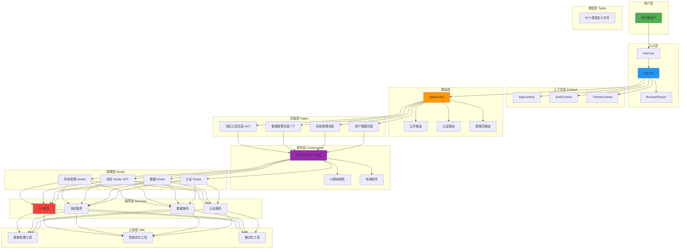

## 2. 数据流图

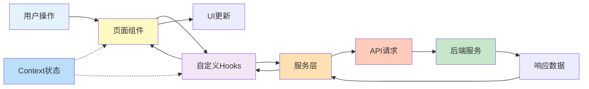

## 3. 组件层级结构

```mermaid
graph TD
    A[components/]
    
    A --> B[ui/ - UI基础组件]
    A --> C[common/ - 公共组件]
    A --> D[layout/ - 布局组件]
    A --> E[routing/ - 路由组件]
    
    A --> F[测试相关组件]
    F --> F1[testing/]
    F --> F2[performance/]
    F --> F3[security/]
    F --> F4[seo/]
    F --> F5[stress/]
    F --> F6[compatibility/]
    
    A --> G[业务组件]
    G --> G1[admin/ - 管理]
    G --> G2[analytics/ - 分析]
    G --> G3[business/ - 业务]
    G --> G4[data/ - 数据]
    G --> G5[reports/ - 报告]
    G --> G6[scheduling/ - 调度]
    
    A --> H[功能组件]
    H --> H1[auth/ - 认证]
    H --> H2[search/ - 搜索]
    H --> H3[monitoring/ - 监控]
    H --> H4[integration/ - 集成]
    H --> H5[charts/ - 图表]
    
    style A fill:#1976D2,color:#fff
    style F fill:#7B1FA2,color:#fff
    style G fill:#388E3C,color:#fff
    style H fill:#D32F2F,color:#fff
```

## 4. 服务层架构

```mermaid
graph TB
    A[Services Layer]
    
    subgraph "核心服务"
        B1[api.ts - API基础]
        B2[testHistoryService.ts]
        B3[adminService.ts]
        B4[errorService.ts]
    end
    
    subgraph "专业服务目录"
        C1[auth/ - 认证服务]
        C2[api/ - API服务]
        C3[testing/ - 测试服务]
        C4[cache/ - 缓存服务]
        C5[monitoring/ - 监控服务]
        C6[analytics/ - 分析服务]
        C7[reporting/ - 报告服务]
        C8[user/ - 用户服务]
    end
    
    subgraph "工具服务"
        D1[backgroundTestManager]
        D2[stressTestQueueManager]
        D3[websocketManager]
        D4[exportManager]
    end
    
    A --> B1 & B2 & B3 & B4
    A --> C1 & C2 & C3 & C4 & C5 & C6 & C7 & C8
    A --> D1 & D2 & D3 & D4
    
    style A fill:#FF5722,color:#fff
    style B1 fill:#FFC107
    style C1 fill:#4CAF50
    style D1 fill:#2196F3
```

## 5. Hooks 组织结构

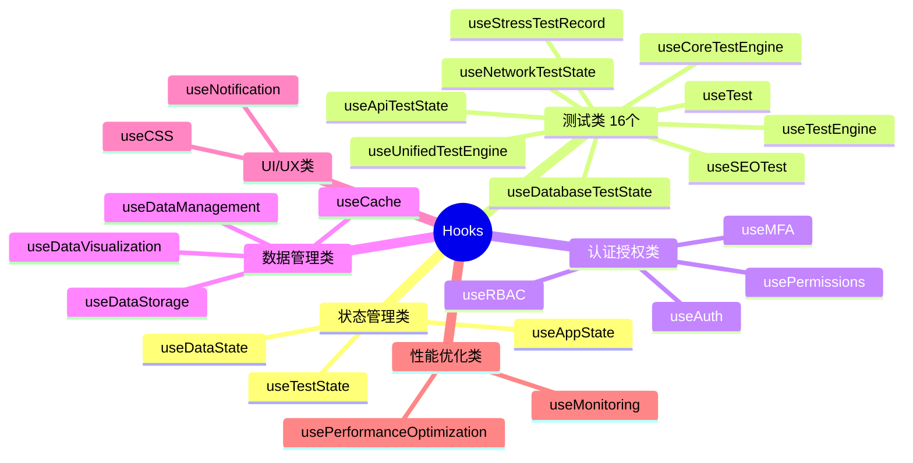

## 6. 路由结构图

```mermaid
graph LR
    A[AppRoutes] --> B[公开路由]
    A --> C[认证路由]
    A --> D[管理员路由]
    
    B --> B1[/login]
    B --> B2[/register]
    B --> B3[/test-*]
    B --> B4[/help]
    
    C --> C1[/dashboard]
    C --> C2[/profile]
    C --> C3[/test-history]
    C --> C4[/reports]
    C --> C5[/notifications]
    
    D --> D1[/admin]
    D --> D2[/admin/users]
    D --> D3[/admin/settings]
    D --> D4[/admin/data-storage]
    
    B3 --> E1[/website-test]
    B3 --> E2[/security-test]
    B3 --> E3[/performance-test]
    B3 --> E4[/seo-test]
    B3 --> E5[/api-test]
    B3 --> E6[/network-test]
    B3 --> E7[/database-test]
    B3 --> E8[/stress-test]
    B3 --> E9[/compatibility-test]
    
    style A fill:#1976D2,color:#fff
    style B fill:#4CAF50
    style C fill:#FF9800
    style D fill:#F44336,color:#fff
```

## 7. 页面分类图

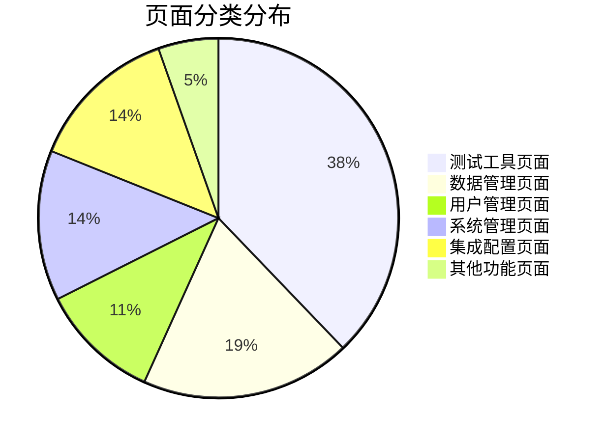

## 8. 技术栈依赖图

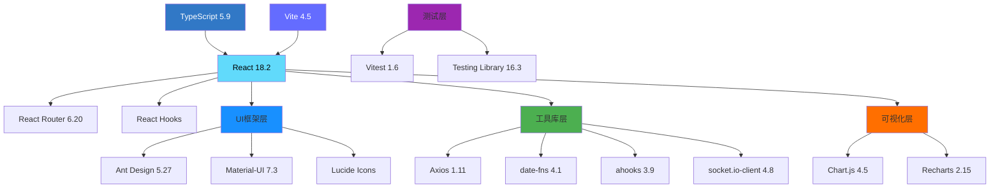

## 9. 状态管理架构

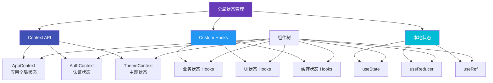

## 10. 测试相关组件生态系统

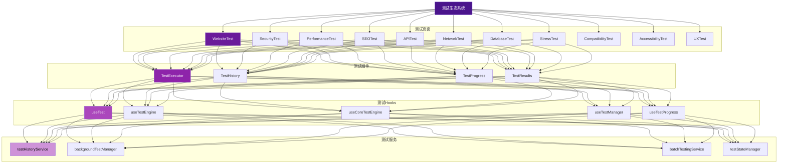

## 11. 文件类型统计

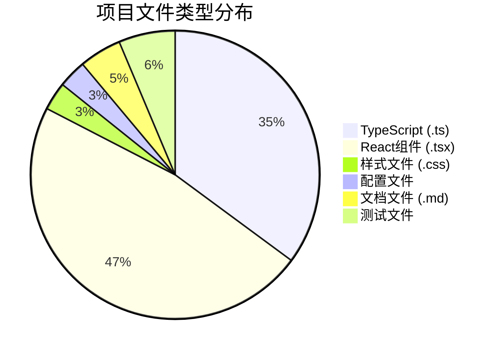

## 12. 项目复杂度评估

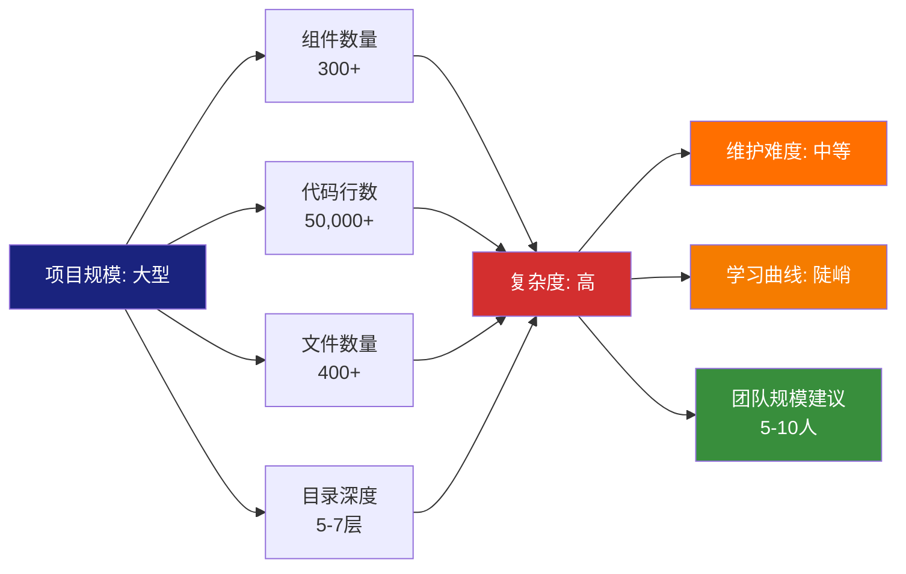

---

## 图表说明

1. **整体架构层次图**: 展示从用户层到工具层的完整技术栈
2. **数据流图**: 展示数据在应用中的流动路径
3. **组件层级结构**: 展示组件目录的组织结构
4. **服务层架构**: 展示服务层的模块划分
5. **Hooks组织结构**: 展示自定义Hooks的分类
6. **路由结构图**: 展示路由的层级关系
7. **页面分类图**: 展示不同类型页面的数量分布
8. **技术栈依赖图**: 展示核心技术栈和依赖关系
9. **状态管理架构**: 展示状态管理的层次结构
10. **测试生态系统**: 展示测试相关的完整生态
11. **文件类型统计**: 展示项目文件类型分布
12. **项目复杂度评估**: 评估项目规模和复杂度

---

**注意**: 这些图表使用 Mermaid 语法编写，可以在支持 Mermaid 的 Markdown 查看器中直接渲染，如：
- GitHub
- GitLab
- VS Code (需要安装 Mermaid 插件)
- Typora
- Obsidian

